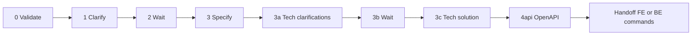

# Complete Development (trunk: Transaction → API contract)

> **Variable Resolution:** Read `.claude/settings.json` before execution. Resolve `{{VARIABLE_NAME}}` placeholders from `env`. Read `features` to determine which steps are active:
> - `features.clarifications` (`true`/`false`) — when `false`, skip clarification steps (1, 2, 3a, 3b).
> - `features.confirm` (`true`/`false`) — when `true`, stop after each completed step and wait for human confirmation before proceeding to the next step.

Run the **shared trunk** for the Transaction in `$ARGUMENTS`: validate and refine the Transaction, produce the functional and technical-solution artifacts, then generate the **OpenAPI / API contract** so frontend and backend tracks can proceed in parallel.

**This command does not run architecture (4a), implementation, tests, or security loops.** After the API contract step (**4api**), the agent must **only** direct the user to **`/frontend-development`** and/or **`/backend-development`** (see [Handoff after trunk](#handoff-after-trunk)).

Clarification pauses (steps 2 and 3b) require human review when `features.clarifications` is `true`. Feature keys for security and tests apply to the track commands, not to this trunk command.

## Parameters

Interpret `$ARGUMENTS` as a space-separated token list. The **only** token is the Transaction ID.

- **requisite-id** (required): Transaction ID (for example: `TX-002-editar-tarefa`).

- **Path convention**: The folder under `{{PATH_DOCS}}/4-implementation/development/` uses the same name as **requisite-id** (also `{tx-id}`). Older skills or agents may use `{tx-id-name}`; treat it as identical to `{tx-id}`.
- **Artefact-catalog source (when present)**: If `{{PATH_DOCS}}/1-analysis/artefacts/TX/{tx-id}.md` or `{{PATH_DOCS}}/1-analysis/artefacts/NTI/{tx-id}.md` exists, that is the read-only source for this Transaction/NTI — see [ingest-artefact-transaction](../skills/ingest-artefact-transaction/SKILL.md). It lives outside `{{PATH_DOCS}}/4-implementation/development/{tx-id}/`, is shared/reused across many transactions, and is never edited by this flow.

## Resume and idempotency (start here on every invocation)

1. Read `{{PATH_DOCS}}/4-implementation/development/{tx-id}/progress.md` if it exists.
2. Verify artifacts on disk (Transaction docs, clarifications, `{tx-id}-complete-transaction.md`, `{tx-id}-technical-solution-transaction.md`, OpenAPI files under the project layout, for example `/api/`).
3. **Determine the source shape** before step 0: check whether `{{PATH_DOCS}}/1-analysis/artefacts/TX/{tx-id}.md` or `{{PATH_DOCS}}/1-analysis/artefacts/NTI/{tx-id}.md` exists (artefact-catalog source — use `ingest-artefact-transaction`) versus a free-prose `{tx-id}.md`/`{tx-id}-revised.md` directly under `{{PATH_DOCS}}/4-implementation/development/{tx-id}/` (legacy source — use `clarify-transaction`/`specify-transaction` as before). The two sources are not both expected for the same TX/NTI. The **per-transaction working folder** (`{{PATH_DOCS}}/4-implementation/development/{tx-id}/`) is created and populated with generated artifacts (clarifications, `{tx-id}-complete-transaction.md`, technical-solution, tech-specs, `progress.md`, `_tree.md`) in **both** cases, exactly as today.
4. Execute **only** the first incomplete trunk step (0 through **4api**). Do not run architect, developer, or test steps inside this command.
5. If trunk through **4api** is already complete: do **not** continue with 4a here. Apply [Handoff after trunk](#handoff-after-trunk) and update `progress.md` *Next step* accordingly.

## Document & Compact (required after each trunk step)

After **each** of: 0, 1, 2, 3, 3a, 3b, 3c, **4api**, apply **Document & Compact**.

**Progress file**: `{{PATH_DOCS}}/4-implementation/development/{tx-id}/progress.md`

Treat **4api** like any other completed step (paths to generated OpenAPI YAML, etc.). Do **not** add a separate dedicated section only for API state; keep a single linear trunk narrative.

### How to execute Document & Compact

1. **Document**: update `progress.md` with:
   - **Transaction**: Transaction ID.
   - **Completed step**: which trunk step just finished (for example: `4api. API contract (OpenAPI)`).
   - **Current state**: artifacts and files produced.
   - **Next step**: the next trunk step, or [Handoff after trunk](#handoff-after-trunk) when 4api is done.
   - **Required context to continue**: paths, summaries, links.
   - **Notes**: blockers, waits for user, optional **Track notes** (frontend/backend) appended without erasing trunk history—see [progress.md and parallel tracks](#progressmd-and-parallel-tracks).

2. **Compact**: ask the user to run **`/compact`**.

3. **Continue**:
   - While still inside the trunk (before 4api is done): *"Read `{{PATH_DOCS}}/4-implementation/development/{tx-id}/progress.md` and continue the **complete-development** trunk from the next indicated step."*

**Exceptions**:
- Do not apply Document & Compact mid–sub-task. Steps 2 and 3b are waits: document, request `/compact`, then resume when the user confirms.
- **After 4api**: only execute step 1 (Document). Skip steps 2 (Compact) and 3 (Continue). Proceed directly to [Handoff after trunk](#handoff-after-trunk) — the handoff message is the terminal output, not a continue instruction.

## Confirmation Gate (`features.confirm`)

When `features.confirm` is `true`, apply a **confirmation gate** after every completed step — including steps that also trigger Document & Compact. After completing a step, stop and output:

```
**Step [X] complete** — [one-line summary of what was produced]
Next: **[Y]** — [one-line description of the next step]
Reply with anything to continue, or with instructions to redirect.
```

Wait for any user reply before proceeding to the next step. Do not continue autonomously. This gate is **separate from Document & Compact**: it does not update `progress.md` and does not request `/compact` — it is a lightweight checkpoint within the same session.

If `features.confirm` is `false`: apply no confirmation gate; proceed through steps without pausing (Document & Compact rules still apply independently).

### Suggested `progress.md` structure

```markdown
# Progress — Complete Development (trunk) — {tx-id}

## Completed step
{example: "4api. API contract (OpenAPI)"}

## Current state
- Generated artifacts: ...
- Main files: ...

## Next step
{example: "Handoff: run /frontend-development and/or /backend-development per technical-solution-transaction scope"}

## Context to continue
- Paths: ...

## Notes
- ...
```

## Flow order (trunk only)

0. **Validate Transaction (product-owner)**  
   **If artefact-catalog source** (`{{PATH_DOCS}}/1-analysis/artefacts/TX/{tx-id}.md` or `NTI/{tx-id}.md` exists): invoke **product-owner** in **VALIDATE mode** following **ingest-artefact-transaction** (`.claude/skills/ingest-artefact-transaction/SKILL.md`) — read the artefact and confirm every ID in its `references`/`mentions`/`screens`/`others` resolves to an existing artefact file (use `StoryNarratives/{TYPE}-Business.json` as a fast index when present). A well-formed catalog TX/NTI is atomic by construction (one Entry/Validation/Result table = one operation), so the split-criteria check below is a fallback, not the primary check.  
   **Otherwise** (legacy free-prose source): invoke **product-owner** in **VALIDATE mode** following **validate-transaction** (`.claude/skills/validate-transaction/SKILL.md`). product-owner validates whether content under `{{PATH_DOCS}}/4-implementation/development/{tx-id}/` qualifies as **one** Transaction per `{{PATH_DOCS}}/4-implementation/development/README.md` and **reports** a verdict (no structure created by the subagent).  
   - **If valid**: proceed to step 1.  
   - **If invalid, split needed, or a referenced artefact ID does not resolve**: product-owner returns justification + split suggestion (folder structure **TX-XXX** / **TX-XXX_01** …) or the list of unresolved IDs, and the inferred dependency order. The **orchestrator** presents this to the user. If the user agrees, the **orchestrator** creates the structure and split documents AND writes `_tree.md` at `{{PATH_DOCS}}/4-implementation/development/{tx-id}/_tree.md` (format: `## Dependencies` table with `| TX | Parents | Notes |`, plus optional `## Tree view (illustrative)` — use the dependency order inferred by product-owner). After writing, the orchestrator outputs: `_tree.md created at: {{PATH_DOCS}}/4-implementation/development/{tx-id}/_tree.md — to develop all sub-transactions: /complete-development-tree --tree {{PATH_DOCS}}/4-implementation/development/{tx-id}/_tree.md`. Then asks permission before Clarify for each sub-Transaction (clarify per sub-id). If the user does not agree, stop.

1. **Clarify (product-owner)** (**skip if** `features.clarifications` is `false`)  
   **If artefact-catalog source**: **ingest-artefact-transaction** resolves the full DE/NTI/SCR/BR/BI/EV bundle referenced by the TX/NTI (see step 3) and reports a **gap list**. `clarify-transaction` + product-owner CLARIFY mode write `{{PATH_DOCS}}/4-implementation/development/{tx-id}/{tx-id}-clarifications.md` **only** for those gaps (unresolved reference, ambiguous CRUD classification, contradiction between resolved artefacts) — do not re-ask what the catalog already answers. If the gap list is empty, skip creating a clarifications file and proceed straight to step 3 (no step 2 wait needed).  
   **Otherwise** (legacy source): **clarify-transaction** + **product-owner** (`.claude/agents/general/product-owner.md`) CLARIFY mode → `{{PATH_DOCS}}/4-implementation/development/{tx-id}/{tx-id}-clarifications.md` (no overwrite of existing; no full spec here).

2. **Wait for user clarification completion** (**skip if** `features.clarifications` is `false`, or if step 1 produced no clarifications file)  
   Pause until the user confirms clarifications are complete.

3. **Specify (product-owner)**  
   **If artefact-catalog source**: **ingest-artefact-transaction** assembles `{tx-id}-complete-transaction.md` by resolving and merging the artefact bundle (DE/NTI/SCR/BR/BI/EV referenced by the TX/NTI), incorporating any answered gap-check clarifications from step 1, following the [Output Mapping](../skills/ingest-artefact-transaction/SKILL.md#output-mapping) so the file matches the same shape `specify-transaction` produces. product-owner SPECIFY mode may still do a light wording pass over the assembled file, but does not author it from scratch.  
   **Otherwise** (legacy source): **specify-transaction** + product-owner SPECIFY mode → `{tx-id}-complete-transaction.md`. Clarifications must be answered.

3a. **Solution Architect (technical clarifications)** (**skip if** `features.clarifications` is `false`)  
   **solution-architect** reads `{{PATH_DOCS}}/3-design/technical-documentation/` first — it is the authoritative answer source. Only asks about what that documentation does **not** already answer (or marks `[TBD]`/Open Issue) → next `{tx-id}-technical-clarifications*.md` (never overwrite existing numbered files). If everything resolves from the technical documentation, no clarifications file is created and the flow proceeds straight to 3c.

3b. **Wait for user to complete technical clarifications** (**skip if** `features.clarifications` is `false`)  
   Pause until the user confirms.

3c. **Solution Architect (technical solution Transaction)**  
   **solution-architect** → `{tx-id}-technical-solution-transaction.md`. This file defines backend and/or frontend scope for the track commands.

4api. **API contract (OpenAPI)**  
   Invoke **api-specialist** (`.claude/agents/backend/api-specialist.md`) and follow **backend/openapi** (`.claude/skills/backend/openapi/SKILL.md`). Produce or update OpenAPI YAML per project layout (for example under `/api/`).  
   **Inputs**: `{tx-id}-complete-transaction.md`, `{tx-id}-technical-solution-transaction.md`, existing API modules as needed.  
   **Output**: contract-first artifacts consumed by **backend-architect** and **frontend-architect** in the track commands.

After 4api: **[Handoff after trunk](#handoff-after-trunk)** only—no step 4a–10 in this command.

## Handoff after trunk

When **4api** is complete (or on resume when trunk is already complete through 4api):

1. Read `{tx-id}-technical-solution-transaction.md` and list which scopes apply (**frontend**, **backend**, or both).
2. Tell the user explicitly:
   - If **frontend scope**: run **`/frontend-development <requisite-id>`** (feature keys come from `settings.json`).
   - If **backend scope**: run **`/backend-development <requisite-id>`** (feature keys come from `settings.json`).
   - If **both**: both commands may run **in parallel** in separate sessions; the OpenAPI contract is shared.
3. Update `progress.md` *Next step* with these commands, not a continuation of complete-development for implementation.

## progress.md and parallel tracks

- **Trunk** stays a **single linear** story through **4api** (including API as a normal step—no separate API-only section).
- **`/frontend-development`** and **`/backend-development`** may append **Notes** or short sub-bullets for their own progress so parallel runs do not erase trunk text; prefer merging new bullets over replacing the file.

## Context management (Document & Compact + /compact)

Same rules as before: prefer Document & Compact between steps; **`/compact`** only between steps if context is tight (~70%); never mid-agent-run.

## End-of-command Transactions (trunk scope)

When the trunk finishes (through **4api**) or you hand off after detecting prior completion:

1. **`git status`**: commit task-relevant work: Transaction docs, clarifications, `{tx-id}-complete-transaction.md`, `{tx-id}-technical-solution-transaction.md`, technical-clarification files, **OpenAPI** files, and `progress.md` updates.
2. Remove or revert irrelevant scratch files.
3. Clean tree per project policy.

## Usage

```
/complete-development <requisite-id>
```

**Examples**

- `/complete-development TX-002-editar-tarefa`

**Resume**

- Before 4api: *"Read `{{PATH_DOCS}}/4-implementation/development/{tx-id}/progress.md` and continue the complete-development trunk from the next indicated step."*
- After 4api: use **`/frontend-development`** and **`/backend-development`** as above (feature keys from `settings.json`); do not use this command for steps 4a–10.

## Flow summary

0 → 1 → 2 (wait) → 3 → 3a → 3b (wait) → 3c → **4api** → **[Document & Compact]** → **handoff: `/frontend-development` / `/backend-development`**.


