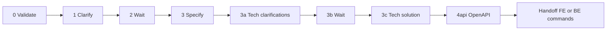

# Complete Development (trunk: requirement → API contract)

Run the **shared trunk** for the requirement in `$ARGUMENTS`: validate and refine the requirement, produce the functional and technical-solution artifacts, then generate the **OpenAPI / API contract** so frontend and backend tracks can proceed in parallel.

**This command does not run architecture (4a), implementation, tests, or security loops.** After the API contract step (**4api**), the agent must **only** direct the user to **`/frontend-development`** and/or **`/backend-development`** (see [Handoff after trunk](#handoff-after-trunk)).

Clarification pauses (steps 2 and 3b) still require human review. There are **no** `--no-security` or `--no-tests` flags on this command; those apply to the track commands.

## Parameters

Interpret `$ARGUMENTS` as a space-separated token list. The **only** token is the requirement ID.

- **requisite-id** (required): requirement ID (for example: `RQ-002-editar-tarefa`).

- **Path convention**: The folder under `.claude/docs/requirements/` uses the same name as **requisite-id** (also `{req-id}`). Older skills or agents may use `{req-id-name}`; treat it as identical to `{req-id}`.

## Resume and idempotency (start here on every invocation)

1. Read `.claude/docs/requirements/{req-id}/progress.md` if it exists.
2. Verify artifacts on disk (requirement docs, clarifications, `{req-id}-complete-requirement.md`, `{req-id}-technical-solution-requirement.md`, OpenAPI files under the project layout, for example `/api/`).
3. Execute **only** the first incomplete trunk step (0 through **4api**). Do not run architect, developer, or test steps inside this command.
4. If trunk through **4api** is already complete: do **not** continue with 4a here. Apply [Handoff after trunk](#handoff-after-trunk) and update `progress.md` *Next step* accordingly.

## Document & Clear (required after each trunk step)

After **each** of: 0, 1, 2, 3, 3a, 3b, 3c, **4api**, apply **Document & Clear**.

**Progress file**: `.claude/docs/requirements/{req-id}/progress.md`

Treat **4api** like any other completed step (paths to generated OpenAPI YAML, etc.). Do **not** add a separate dedicated section only for API state; keep a single linear trunk narrative.

### How to execute Document & Clear

1. **Document**: update `progress.md` with:
   - **Requirement**: requirement ID.
   - **Completed step**: which trunk step just finished (for example: `4api. API contract (OpenAPI)`).
   - **Current state**: artifacts and files produced.
   - **Next step**: the next trunk step, or [Handoff after trunk](#handoff-after-trunk) when 4api is done.
   - **Required context to continue**: paths, summaries, links.
   - **Notes**: blockers, waits for user, optional **Track notes** (frontend/backend) appended without erasing trunk history—see [progress.md and parallel tracks](#progressmd-and-parallel-tracks).

2. **Clear**: ask the user to run **`/clear`**.

3. **Continue**:
   - While still inside the trunk (before 4api is done): *"Read `.claude/docs/requirements/{req-id}/progress.md` and continue the **complete-development** trunk from the next indicated step."*
   - After **4api** is done: *"Read `progress.md` and run **`/frontend-development {req-id}`** and/or **`/backend-development {req-id}`** (with optional `--no-security` / `--no-tests`) as scope allows."*

**Exceptions**: Do not apply Document & Clear mid–sub-task. Steps 2 and 3b are waits: document, request `/clear`, then resume when the user confirms.

### Suggested `progress.md` structure

```markdown
# Progress — Complete Development (trunk) — {req-id}

## Completed step
{example: "4api. API contract (OpenAPI)"}

## Current state
- Generated artifacts: ...
- Main files: ...

## Next step
{example: "Handoff: run /frontend-development and/or /backend-development per technical-solution-requirement scope"}

## Context to continue
- Paths: ...

## Notes
- ...
```

## Flow order (trunk only)

0. **Validate requirement**  
   Use **validate-requirement** (`.claude/skills/validate-requirement/SKILL.md`). Validate whether content under `.claude/docs/requirements/{req-id}/` qualifies as **one** requirement per `.claude/docs/requirements/README.md`.  
   - **If valid**: proceed to step 1.  
   - **If invalid or split needed**: report and suggest split **RQ-XXX** / **RQ-XXX_01** …; if the user agrees, create structure and handle each sub-requirement (clarify per sub-id). If not, stop.

1. **Clarify (product-owner)**  
   **clarify-requirement** + **product-owner** (`.claude/agents/general/product-owner.md`) CLARIFY mode → `.claude/docs/requirements/{req-id}/{req-id}-clarifications.md` (no overwrite of existing; no full spec here).

2. **Wait for user clarification completion**  
   Pause until the user confirms clarifications are complete.

3. **Specify (product-owner)**  
   **specify-requirement** + product-owner SPECIFY mode → `{req-id}-complete-requirement.md`. Clarifications must be answered.

3a. **Solution Architect (technical clarifications)**  
   **solution-architect** → next `{req-id}-technical-clarifications*.md` (never overwrite existing numbered files).

3b. **Wait for user to complete technical clarifications**  
   Pause until the user confirms.

3c. **Solution Architect (technical solution requirement)**  
   **solution-architect** → `{req-id}-technical-solution-requirement.md`. This file defines backend and/or frontend scope for the track commands.

4api. **API contract (OpenAPI)**  
   Invoke **api-specialist** (`.claude/agents/backend/api-specialist.md`) and follow **backend/openapi** (`.claude/skills/backend/openapi/SKILL.md`). Produce or update OpenAPI YAML per project layout (for example under `/api/`).  
   **Inputs**: `{req-id}-complete-requirement.md`, `{req-id}-technical-solution-requirement.md`, existing API modules as needed.  
   **Output**: contract-first artifacts consumed by **backend-architect** and **frontend-architect** in the track commands.

After 4api: **[Handoff after trunk](#handoff-after-trunk)** only—no step 4a–10 in this command.

## Handoff after trunk

When **4api** is complete (or on resume when trunk is already complete through 4api):

1. Read `{req-id}-technical-solution-requirement.md` and list which scopes apply (**frontend**, **backend**, or both).
2. Tell the user explicitly:
   - If **frontend scope**: run **`/frontend-development <requisite-id>`** (optional: `--no-security`, `--no-tests`).
   - If **backend scope**: run **`/backend-development <requisite-id>`** (optional: `--no-security`, `--no-tests`).
   - If **both**: both commands may run **in parallel** in separate sessions; the OpenAPI contract is shared.
3. Update `progress.md` *Next step* with these commands, not a continuation of complete-development for implementation.

## progress.md and parallel tracks

- **Trunk** stays a **single linear** story through **4api** (including API as a normal step—no separate API-only section).
- **`/frontend-development`** and **`/backend-development`** may append **Notes** or short sub-bullets for their own progress so parallel runs do not erase trunk text; prefer merging new bullets over replacing the file.

## Context management (Document & Clear + /compact)

Same rules as before: prefer Document & Clear between steps; **`/compact`** only between steps if context is tight (~70%); never mid-agent-run.

## End-of-command requirements (trunk scope)

When the trunk finishes (through **4api**) or you hand off after detecting prior completion:

1. **`git status`**: commit task-relevant work: requirement docs, clarifications, `{req-id}-complete-requirement.md`, `{req-id}-technical-solution-requirement.md`, technical-clarification files, **OpenAPI** files, and `progress.md` updates.
2. Remove or revert irrelevant scratch files.
3. Clean tree per project policy.

## Usage

```
/complete-development <requisite-id>
```

**Examples**

- `/complete-development RQ-002-editar-tarefa`

**Resume**

- Before 4api: *"Read `.claude/docs/requirements/{req-id}/progress.md` and continue the complete-development trunk from the next indicated step."*
- After 4api: use **`/frontend-development`** and **`/backend-development`** as above; do not use this command for steps 4a–10.

## Flow summary

0 → 1 → 2 (wait) → 3 → 3a → 3b (wait) → 3c → **4api** → **[Document & Clear]** → **handoff: `/frontend-development` / `/backend-development`**.


