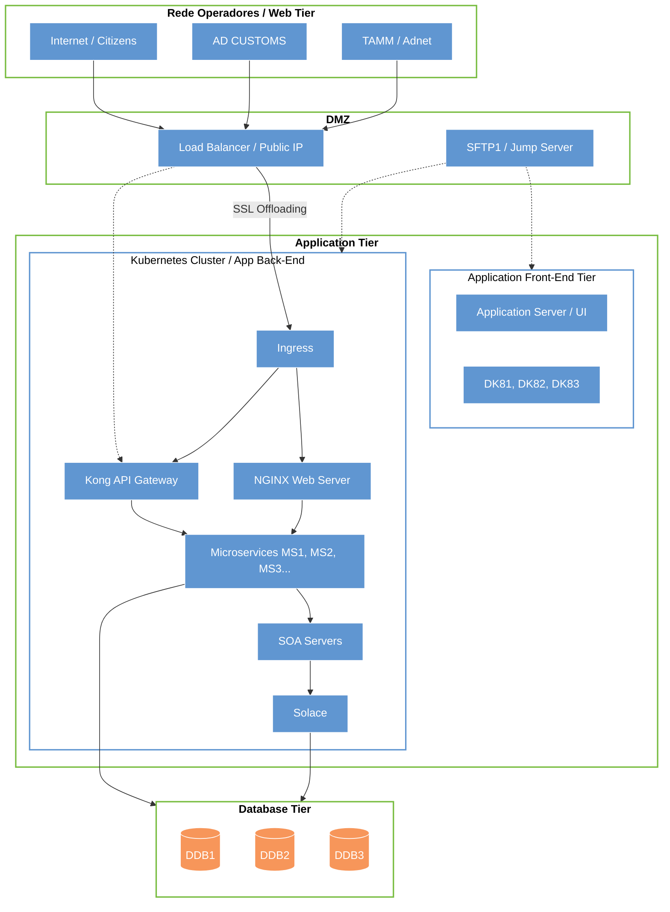
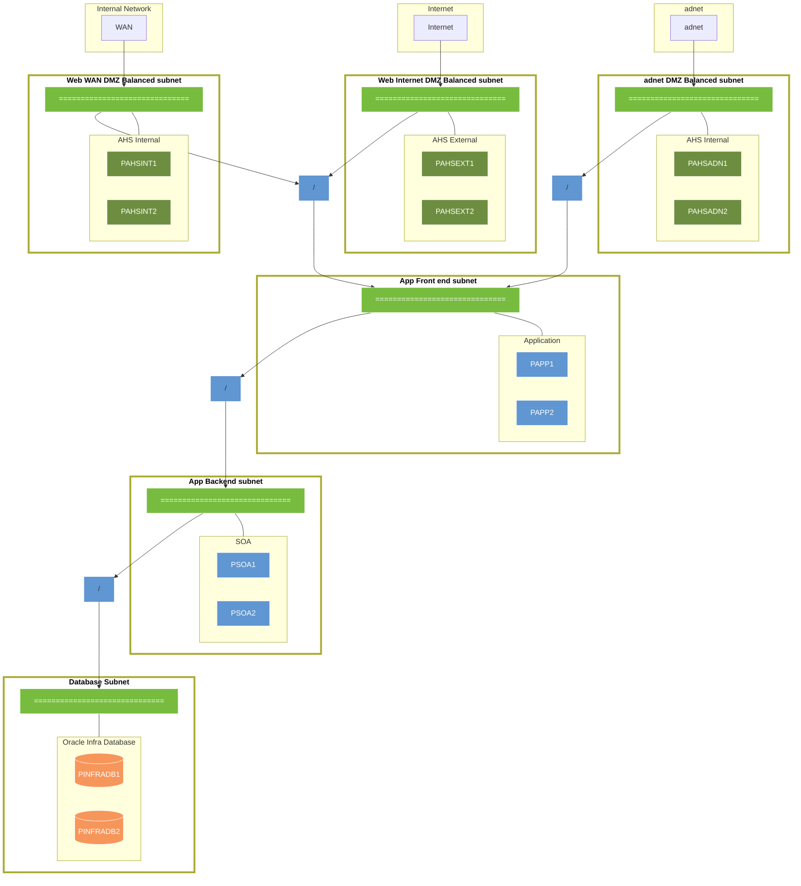
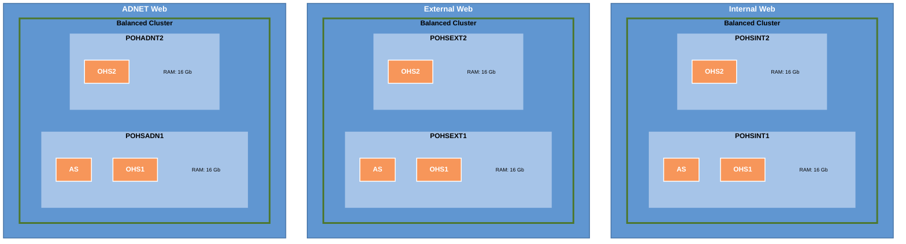
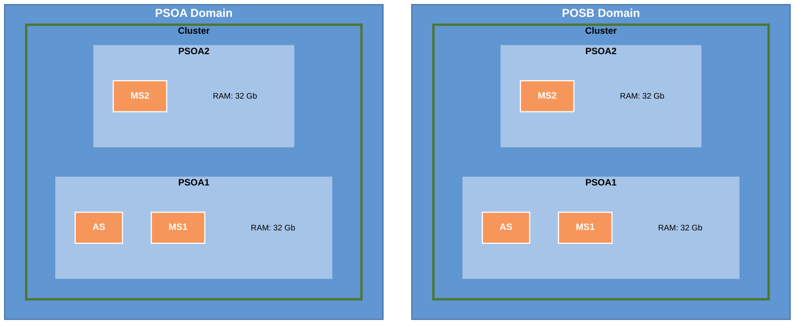
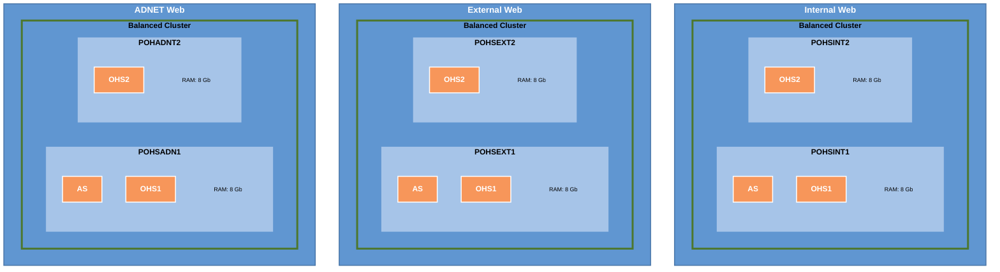
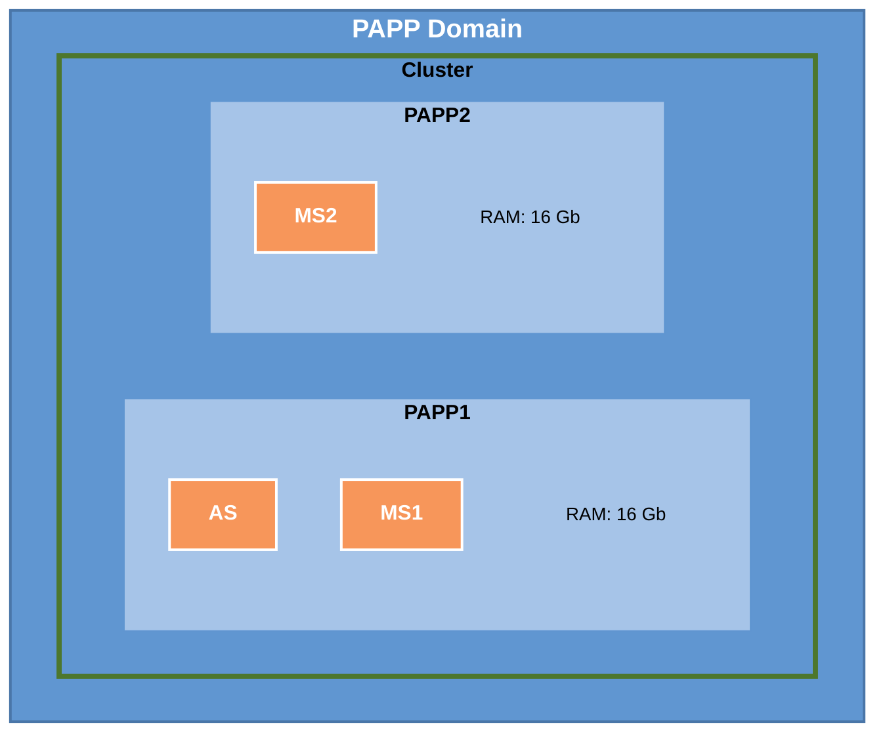
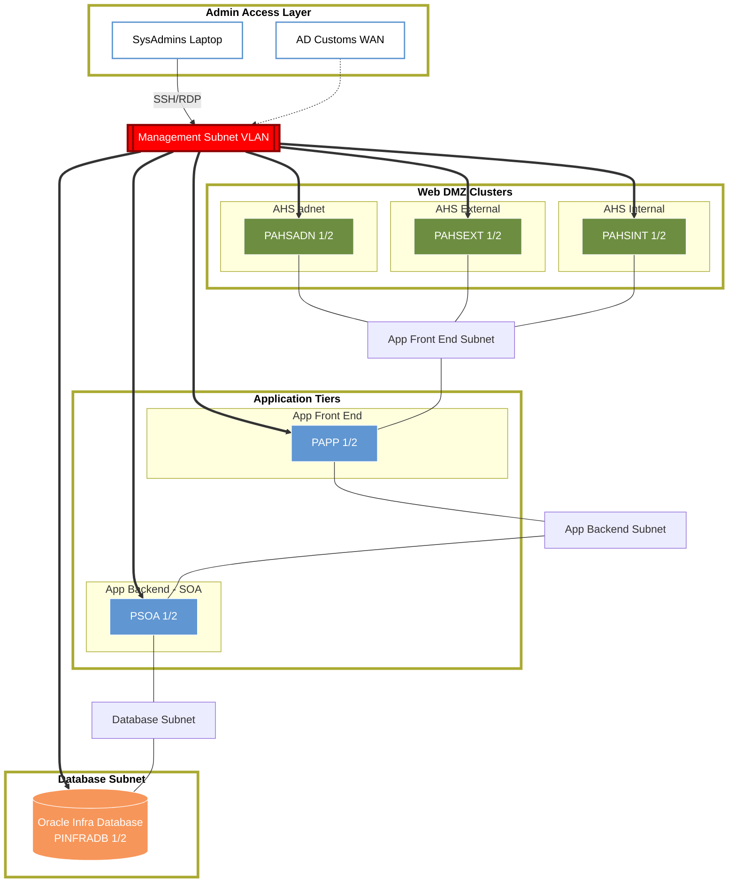

# Hardware and Software Design, v1.5

# Digital Experience Platform

Document produced by:

**Link Consulting – Tecnologias de Informação, S. A.**

To:

**AD Customs**

Project nº ADCU_19_0435

2020-07-31

# Document Control

## Document Information

|  |  |
| --- | --- |
| Project: | ADCU_19_0435 - Digital Experience Platform |
| Document Title: | Hardware and Software Design |
| Template: | Requirements Specification Template v3.1 |
| Author(s): | Gonçalo Pereira |
| Version: | 1.5 |
| Version Date: | 2020-07-31 |
| Information Classification: | Restricted |
| Status: | Draft |

## Revisions History

| Version | Date | By | Changes Description |
| --- | --- | --- | --- |
| 1.0 | 2019-11-05 | Manuel Fonseca | Document Creation. |
| 1.1 | 2019-11-11 | Mohammed Ajamieh | Updated VLAN information |
| 1.2 | 2019-11-20 | José Pires | Small updates |
| 1.3 | 2020-03-11 | Paulo Rodrigues | Small updates (shared storage) |
| 1.4 | 2020-07-20 | Paulo Rodrigues | Small updates () |
| 1.5 | 2020-07-31 | Gonçalo Pereira | Updated Network Information |

**DOCUMENT APPROVALS**

| Approver Name | Project Role | Signature / Electronic Approval | Date |
| --- | --- | --- | --- |
|  |  |  |  |

# Introduction

This document describes the technical architecture and design specification for Digital Experience Platform project.

## Document Scope

The current document’s goal is to identify and specify all software components to be installed, along with a macro definition of all servers to be installed.

This will be a working document, where on the first version the information will tentatively be provided and where we will also identify a set of data that must be gathered from the AD Customs infra-structure team.

Therefore, the main objectives for this document are:

- Identify all software components to be installed

- Define and identify each server (virtual or otherwise) that will host each component, and by doing so, identify also their requirements (CPU, Memory, Storage, network name and IP addresses).

- Identify all proposed V-LAN’s and subnets to be used by all environments, possibly identifying also a set of base routings needed to be guaranteed between them.

The final version of this document will provide a clear picture of the following environments:

- Production

- Staging

This will include a detailed description of each server, and the ports that are expected to be in use on each machine.

## Audience

The current document will be relevant to the following roles:

- **Infra-structure team**, this should include Network, Systems and Security teams. The present document will be completed with their valuable input, and in the future this document should also be used as reference by these teams.

- **Project Software Installation team**, as a guide on what needs to be installed and where.

- **Project management team**, to understand the necessary resources (software and hardware) that the project will need for the installation to be successfully concluded.

## Document Structure

Section 1, “**Introduction**”, offers the overview of this document as well as audience and structure.

Section 2, “**Project Scope**”, describes the scope for carrying out the project and stakeholders involved.

Section 3, “**Installation Pre-Requirements**”, contains the Installation pre-requirements that must be guaranteed before starting the installation effort.

Section 4, “**Software Products**”, contains a list of all software products to be installed.

Section 5, “**Physical Architecture**”, describes the solution physical architecture focusing the description on the Production environment.

Section 6, “**Logical Architecture**”, presents a detailed description of the logical architecture of each environment.

Section 7, “**Security and Network**”, enumerates all the network related information needed to configure and manage all environments.

Section 8, “**Related Documents**”, contains related documents used during requirements gathering.

Section 9, “**Attachments**”, contains references to relevant related data used during requirements gathering.

## Glossary

This section provides a detailed, alphabetically ordered glossary of the business domain, defining each and every one of the business concepts relevant to the project.

The table below identifies definitions, terms, and acronyms used throughout this document.

| Item | Description |
| --- | --- |
| VLAN | Virtual LANs |
| Virtual IP | An IP address that can reference other IP addresses. |
| FQDN | Fully Qualified Domain Name, the complete name for which the machine will be known in the network. |

**Table 1 – Glossary**

# Project Scope

This section describes the scope of the project and sets the boundaries of the solution.

## Project Overview

This current project includes the setup of an infra-structure, and that means preparing and installing the following components:

- Oracle Database Enterprise Edition

- Oracle SOA Suite

- Oracle Weblogic Server to host Custom developed applications

- Oracle HTTP Server

And do this within the two identified environments, since the development environment is described in a separate document. The use of these environments ensures a proper development procedure and the best possible Quality Assurance methodologies.

## Participants

This section provides a complete list of key users for the project with knowledge and authority to make decisions about requirements that may have a direct or indirect influence on the requirements.

| Team | Contact Name | Description | Phone | E-mail |
| --- | --- | --- | --- | --- |
| **AD Customs** | Mohammed Khalil Abu Ajamieh | Project Manager | Tel: [02-8102908](tel:02-8102908)   Mobile: [050-4278758](tel:050-4278758) | [mohammed.ajamieh@adcustoms.ae](mailto:mohammed.ajamieh@adcustoms.ae) |
| **Link Consulting** | José Pires | Project Sponsor | [\+351 962 686 131](tel:+351962686131) | [jose.pires@linkconsulting.com](mailto:jose.pires@linkconsulting.com) |
| **Link Consulting** | Manuel Fonseca | Infrastructure Specialist | [\+351 936 884 544](tel:+351936884544) | [manuel.fonseca@linkconsutlting.com](mailto:manuel.fonseca@linkconsutlting.com) |

**Table 2 - Participants**

# Installation Pre-Requirements

In order for the installation procedures to be conducted effectively, there are some requirements that must be fulfilled. We describe them below.

**Team and work organization**

- The infrastructure preparation will be conducted by AD Customs. This includes provisioning of hardware, virtual hosts, operating systems and network configuration, according to the requirements identified in this document.

- The installation of Oracle Fusion Middleware will be conducted by Link. This includes the installation and configuration of all the products according to the requirements identified in this document.

- The validation of the installation stage will be conducted by Link. This includes the validation of the infrastructure preparation (network connectivity, sizing) as well as the validation of the products installation (configuration, inter-connectivity).

- The Link team that will perform the installation of the products will have to be granted remote VPN access to AD CUSTOMS network and the appointed machines.

- The Link team that will perform the installation of the products will have to be granted SSH access rights to all machines. This access shall include the rights to create X11 sessions and run the software installer wizards.

- The Link team that will perform the validation of the products installation will have to be granted remote VPN access to AD CUSTOMS network.

- The Link team that will perform the validation of the products installation will have to be granted SSH access rights to all machines. This access shall include the rights to create X11 sessions and run the software installer wizards.

- While setting up the products, the Link team shall be granted root access on all project machines.

- It is expected that the team performing the products installation is experienced in this type of setup, therefore this document is to serve as a guideline and not an installation manual.

**Database**

- It is expected to use an Oracle Database as the main database server for the entire project and all products.

- Oracle database installation and configuration will be performed by Link Team.

- On some key occasions, Link team will require sysdba access to perform a select number of operations during the products installation. It is therefore required to provide such access (password needs to be shared to be used within the installations scripts) when the need arises.

- Database installation, and RAC in particular, has quite specific requirements regarding the network configuration and storage volumes assignment. These will be shared in a separate document.

**Network Related Remarks**

- All installed machines will respect the IP’s and FQDN’s to be defined in the present document.

- All FQDNs, and their respective IP addresses, must be registered in the network DNS.

- For the identified server clusters, and where a VIP or Load Balancer is identified, the necessary network configuration should be performed by the team responsible for the network configuration. A hardware or software component should be identified to serve as load balancer for all the clustered domains.

- Connection between the several servers in the same environment is guaranteed, e.g. The Database server is accessible by Oracle Fusion Middleware servers.

- All this should be guaranteed before the software installation process starts.

**Hardware Related Remarks**

- The proposed architecture assumes the use of an Intel Xenon processor to determine the CPU Core Factor in order to establish the VCPU’s to be used on each virtual server.  That said, the enumerated CPU’s should be revised against the licensed products and adopted hardware CPU architecture.

- The proposed clustered environments assumes a minimum of two virtual servers in order to guarantee the system high availability. It is assumed that these two virtual machines are to be hosted on two different physical machines.

**Additional Remarks**

- All machines (virtual or otherwise) to be used in the solution will respect the information described in the present document.

# Software Products

The following sections describe the software products to be installed through the course of this project.

## Recommendations

Our recommendation is to use, wherever it is possible, the version 12c for all software products involved in the solution. We believe 12c is the best suited version, since it is Oracle’s latest version and will be taking full advantage of the new features.

On an additional note, in order to optimize system performance and resources and also to reduce the dependencies between products (important when considering patching and upgrade strategies), we recommend each product to be hosted on its own server/cluster.

The table below details the Oracle products to be used in the current solution:

| Product | JDK Version | Version |
| --- | --- | --- |
| Oracle Database | N/A | 18c |
| Oracle HTTP Server | 1.8.0_231 | 12.2.1.4 |
| Oracle WebLogic Server | 1.8.0_231 | 12.2.1.4 |
| Oracle SOA | 1.8.0_231 | 12.2.1.4 |

**Table 3 - Oracle Products Solution**

The following table we mention the list of software to be installed per type of server:

| Server Type | Software List |
| --- | --- |
| Database Server | Oracle RAC Database (Only For the RAC environments) |
| Web Server | Oracle HTTP Server |
| Application Server | Oracle Weblogic Server |
| SOA Server | Oracle Weblogic Server   Oracle SOA Suite   Oracle Service Bus |

**Table 4 – Products Per Server Type**

## OS Required Packages

The existing configurations use the following distributions:

  - Oracle Linux 7.7

In all situations, it is expected that the Operating System should keep the following additional packages:

- binutils-2.23.52.0.1

- compat-libcap1-1.10

- compat-libstdc++-33-3.2.3 for x86_64

- compat-libstdc++-33-3.2.3 for i686

- gcc-4.8.2

- gcc-c++-4.8.2

- glibc-2.17 for x86_64

- glibc-2.17 for i686

- glibc-devel-2.17 for x86_64

- libaio-0.3.109 for x86_64

- libaio-devel-0.3.109 for x86_64

- libgcc-4.8.2 for x86_64

- libgcc-4.8.2 for i686

- libstdc++-4.8.2 for x86_64

- libstdc++-4.8.2 for i686

- libstdc++-devel-4.8.2 for x86_64

- ksh

- make-3.82

- sysstat-10.1.5

- numactl-2.0.9 for x86_64

- numactl-devel-2.0.9 for x86_64

- motif-2.3.4-7 for x86_64Foot 3

- motif-devel-2.3.4-7 for x86_64

For further information, please refer to [http://docs.oracle.com/html/E77908_01/toc.htm](http://docs.oracle.com/html/E77908_01/toc.htm)

## File system organisation

We propose that the Operating system should follow the standard Filesystem hierarchy for Unix file systems, where a few separate mount points are created to host some of its directories, such as:

| Mount Point | Recommended Size | Remarks |
| --- | --- | --- |
| / | 100 Gb |  |
| /tmp | 20 Gb |  |
| /var | 10 Gb |  |
| /var/log | 25 Gb |  |
| /var/tmp | 20 Gb |  |
| /var/tmp/log | 25 Gb |  |
| /home | 40 Gb | OHS Servers can have this reduced to 20 Gb. |
| /u01/ | 200 Gb | To be used for Managed Servers Home. |
| /u02/ | 200 Gb | To be used for Java HOME, MW Home and Admin Server Home (Domain home) |

Additionally to these mounts points, we use Oracle naming convention to create the Products and Shared volumes used by the applications. The convention used was:

- /u01, hosted by a local filesystem, where the domain and managed server directories are stored. On a clustered environment, each node will have a /u01 directory where the managed servers, running on that node, will store their files.

- /u02, possibly hosted by a clustered file system (e.g. OCFS2) or a network file system (e.g. NFS), this mount point is only available on clustered machines, and it exposes a shared filesystem between the nodes of the cluster. This file system is used to store the Middleware home and the shared configuration files.

Each application is installed under its own user (e.g. production SOA runs with the oracle system user, if two applications are to be installed under the same server then the use of a second account is recommended) and that system user will have a set of environment variables that can be used as shortcuts to the most important directories in the system, for instance:

- Under clustered installations (Staging and Production environments)

  - $JAVA_HOME, points to the directory where the java package will be installed. It is further recommended that this location is represented by a “symbolic link” named “java_current” which will effectively point to the correct java location. In the single node case this is usually under /u01 mount point.

  - $ADOMAIN_HOME, points to the Administration Domain home directory, under which it can be found the domain binaries along with the AdminServer files. This directory is normally placed under /u02 volume.

  - $MDOMAIN_HOME, points to the Managed Servers Domain home directory, under which it can be found the domain binaries along with the Managed server files, including the nodemanager configurations and binaries. This directory is normally placed under /u01 volume.

  - $MW_HOME, points to the Middleware home directory, which contains all product binaries for the FMW suite. On clustered environments this directory is normally placed under the shared /u01 volume.

# Physical Architecture

## Layer Architecture

**Diagram 1 – Production Layer Architecture**

From the previous diagram we would highlight the following points:

- The Web Tier is divided into 3 areas, one exposing the system to the Citizens through the Internet channel, another to AD CUSTOMS users and the third one on the adnet to expose services to TAMM. On all cases the available servers should be accessed through a load balancer (with a public IP address) and that will handle any SSL certificates and traffic.

- It is assumed and accepted to have a data flow from the Web Tier to the Application back-end tier, bypassing the application front-end tier, this is the recommended way to expose an OSB mediated service to external consumers.

- While the Application server is hosted on the application front-end tier due to assumedly having End Users interface, it should also be considered the cluster to host application back-end services.

- SOA servers are hosted on the application back-end tier.

## Network Architecture

The following diagram depicts a summarized abstraction of the several subnets and servers that are expected to be used on the production environment of the AD CUSTOMS.

**Diagram 2 – Production Network Diagram**

The depicted diagram shows the need to setup 5 network areas:

- **Internal DMZ**, this area will be exposed to the WAN networks and it is the entry point for AD CUSTOMS users while accessing the system. For security reasons, this network only hosts Web Servers. These servers will be clustered and under a Load Balancer in order to guarantee resilience and also increase the overall throughput.

- **External DMZ**, this area fulfils a similar purpose as the previous DMZ, but this time it is exposed to the Internet and it represents the main entry point through which the public will access the system.  Similarly, it is expected to host only web servers in this area, and the web servers will work in a cluster under a load balancer for resilience and high availability.

- **Adnet DMZ**, this area fulfils a similar purpose as the previous DMZ, but it is exposed to the Government Network (adnet) and it represents the main entry point through which TAMM and other government entities will access the system.  Similarly, it is expected to host only web servers in this area, and the web servers will work in a cluster under a load balancer for resilience and high availability.

- **Application Front end subnet**, this area will host all front-end related servers of the application. By this, it is understood as the servers that expose end user interfaces (e.g. Application servers).

- **Application Backend subnet**, this area will host all back-end related servers of the application. By this, it is understood as the servers that expose mostly services to other application components (e.g. OSB).

- **Database subnet**, this network will be dedicated to the Database.

# Logical Architecture

The following sections describe the Products logical domains, with a matched correspondence with the Virtual Servers where they will be installed. All names and designations were arbitrarily defined, and must be revised on the early stages of the installation process.

## Production Environment

**Diagram 3 – Production Logical Diagram – Web Layer**

**Diagram 4 – Production Logical Diagram – App. Front-End**

**Diagram 5 – Production Logical Diagram – App. Back-end**

The following table resumes the information depicted on the previous diagrams in a more succinct form:

| Virtual Server | vCPU | Memory | Local Storage | Mount Point | Shared Storage |  |
| --- | --- | --- | --- | --- | --- | --- |
| POHSEXT1 | 2 | 16 GB | 230GB | / | 50GB | |
| | | | | /tmp | 10GB | |
| | | | | /var | 10GB | |
| | | | | /var/log | 25GB | |
| | | | | /var/tmp | 20GB | |
| | | | | /var/tmp/log | 25GB | |
| | | | | /home | 40GB | |
| | | | | /u01 | 50GB | |
| POHSEXT2 | 2 | 16 GB | 230GB | / | 50GB | |
| | | | | /tmp | 10GB | |
| | | | | /var | 10GB | |
| | | | | /var/log | 25GB | |
| | | | | /var/tmp | 20GB | |
| | | | | /var/tmp/log | 25GB | |
| | | | | /home | 40GB | |
| | | | | /u01 | 50GB | |
| POHSINT1 | 2 | 16 GB | 230GB | / | 50GB | |
| | | | | /tmp | 10GB | |
| | | | | /var | 10GB | |
| | | | | /var/log | 25GB | |
| | | | | /var/tmp | 20GB | |
| | | | | /var/tmp/log | 25GB | |
| | | | | /home | 40GB | |
| | | | | /u01 | 50GB | |
| POHSINT2 | 2 | 16 GB | 230GB | / | 50GB | |
| | | | | /tmp | 10GB | |
| | | | | /var | 10GB | |
| | | | | /var/log | 25GB | |
| | | | | /var/tmp | 20GB | |
| | | | | /var/tmp/log | 25GB | |
| | | | | /home | 40GB | |
| | | | | /u01 | 50GB | |
| POHSADN1 | 2 | 16 GB | 230GB | / | 50GB | |
| | | | | /tmp | 10GB | |
| | | | | /var | 10GB | |
| | | | | /var/log | 25GB | |
| | | | | /var/tmp | 20GB | |
| | | | | /var/tmp/log | 25GB | |
| | | | | /home | 40GB | |
| | | | | /u01 | 50GB | |
| POHSADN2 | 2 | 16 GB | 230GB | / | 50GB | |
| | | | | /tmp | 10GB | |
| | | | | /var | 10GB | |
| | | | | /var/log | 25GB | |
| | | | | /var/tmp | 20GB | |
| | | | | /var/tmp/log | 25GB | |
| | | | | /home | 40GB | |
| | | | | /u01 | 50GB | |
| PAPP1 | 4 | 32 GB | 240GB | / | 100GB | |
| | | | | /tmp | 20GB | |
| | | | | /var | 10GB | |
| | | | | /var/log | 25GB | |
| | | | | /var/tmp | 20GB | |
| | | | | /var/tmp/log | 25GB | |
| | | | | /home | 40GB | |
| | | | 200GB | /u01 | 200GB | |
| | | | | /u02 | PRD_APP | PRD_APP |
| PAPP2 | 4 | 32 GB | 240GB | / | 100GB | |
| | | | | /tmp | 20GB | |
| | | | | /var | 10GB | |
| | | | | /var/log | 25GB | |
| | | | | /var/tmp | 20GB | |
| | | | | /var/tmp/log | 25GB | |
| | | | | /home | 40GB | |
| | | | 200GB | /u01 | 200GB | |
| | | | | /u02 | PRD_APP | PRD_APP |
| PSOA1 | 4 | 32 GB | 240GB | / | 100GB | |
| | | | | /tmp | 20GB | |
| | | | | /var | 10GB | |
| | | | | /var/log | 25GB | |
| | | | | /var/tmp | 20GB | |
| | | | | /var/tmp/log | 25GB | |
| | | | | /home | 40GB | |
| | | | 300GB | /u01 | 300GB | |
| | | | | /u02 | PRD_SOA | PRD_SOA |
| PSOA2 | 4 | 32 GB | 240GB | / | 100GB | |
| | | | | /tmp | 20GB | |
| | | | | /var | 10GB | |
| | | | | /var/log | 25GB | |
| | | | | /var/tmp | 20GB | |
| | | | | /var/tmp/log | 25GB | |
| | | | | /home | 40GB | |
| | | | 300GB | /u01 | 300GB | |
| | | | | /u02 | PRD_SOA | PRD_SOA |
| PINFRADB1 | 4 | 64 GB | 500GB | PRD_DB_DATA | | |
| | | | | PRD_DB_FRA | | |
| PINFRADB2 | 4 | 64 GB | 500GB | PRD_DB_DATA | | |
| | | | | PRD_DB_FRA | | |

**Table 5 – Production Virtual Server and Domain List**

| Environment | Storage Area Designation | Storage Space |
| --- | --- | --- |
| Production | PRD_APP | 200 Gb |
| Production | PRD_SOA | 300 Gb |

**Table 6 – Production Shared Storage List**

| Environment | Storage Area Designation | Storage Space |
| --- | --- | --- |
| Production | PRD_DB_DATA | 4 Volumes of 250Gb   Total: 1000 Gb |
| Production | PRD_DB_FRA | 4 Volumes of 25 Gb   Total: 100Gb |

**Table 7 – Production database Volumes Storage List**

It is highly recommended that Oracle ASM be used as Oracle Database files filesystem as ASM provides out-of-box enablement of several features in redundancy and performance space.

The following should be considered to avoid performance and availability issues:

- Implement multiple access paths to the storage array using two or more HBAs

- Deploy multipath software over these HBAs to provide Load Balancing and Failover in storage layer.

- Oracle ASM and database instances require shared access to the disks in a disk group.

- The disks that will be used in ASM Diskgroup should be the same size (ex: 250GB or 500GB)

- At least, and if possible use more than 4 disks on each diskgroup. This is more true on the diskgroups that handle the database workload (DATA) and Recovery Area (FRA).

- Ensure that all Oracle ASM disks in a disk group have similar storage performance and availability characteristics.

- Create external redundancy disk groups when using high-end storage arrays (RAID10 for example). High-end storage arrays generally provide hardware RAID protection.

The required shared storage space for each environment must be revised based on actual process design and usage.

The following table presents a suggested sizing for database storage:

| Database Schema | Recommended Size | Remarks |
| --- | --- | --- |
| APP | 500 Gb |  |
| OSB | 300 Gb |  |
| SOA | 300 Gb |  |

**Table 8 – Production Database sizing List**

The proposed database size should be revised whenever a project, or application, on boarding occurs.

## Staging Environment

**Diagram 6 – Staging Logical Diagram – Web Layer**

**Diagram 7 – Staging Logical Diagram – App. Front-End**

**Diagram 8 – Staging Logical Diagram – App. Back-end**

The following table resumes the information depicted on the previous diagrams in a more succinct form:

| Virtual Server | vCPU | Memory | Local Storage | Mount Point | Shared Storage |  |
| --- | --- | --- | --- | --- | --- | --- |
| SOHSEXT1 | 1 | 8 GB | 230GB | / | 50GB |  |
|  |  |  |  | /tmp | 10GB |  |
|  |  |  |  | /var | 10GB |  |
|  |  |  |  | /var/log | 25GB |  |
|  |  |  |  | /var/tmp | 20GB |  |
|  |  |  |  | /var/tmp/log | 25GB |  |
|  |  |  |  | /home | 40GB |  |
|  |  |  |  | /u01 | 50GB |  |
| SOHSEXT2 | 1 | 8 GB | 230GB | / | 50GB |  |
|  |  |  |  | /tmp | 10GB |  |
|  |  |  |  | /var | 10GB |  |
|  |  |  |  | /var/log | 25GB |  |
|  |  |  |  | /var/tmp | 20GB |  |
|  |  |  |  | /var/tmp/log | 25GB |  |
|  |  |  |  | /home | 40GB |  |
|  |  |  |  | /u01 | 50GB |  |
| SOHSINT1 | 1 | 8 GB | 230GB | / | 50GB |  |
|  |  |  |  | /tmp | 10GB |  |
|  |  |  |  | /var | 10GB |  |
|  |  |  |  | /var/log | 25GB |  |
|  |  |  |  | /var/tmp | 20GB |  |
|  |  |  |  | /var/tmp/log | 25GB |  |
|  |  |  |  | /home | 40GB |  |
|  |  |  |  | /u01 | 50GB |  |
| SOHSINT2 | 1 | 8 GB | 230GB | / | 50GB |  |
|  |  |  |  | /tmp | 10GB |  |
|  |  |  |  | /var | 10GB |  |
|  |  |  |  | /var/log | 25GB |  |
|  |  |  |  | /var/tmp | 20GB |  |
|  |  |  |  | /var/tmp/log | 25GB |  |
|  |  |  |  | /home | 40GB |  |
|  |  |  |  | /u01 | 50GB |  |
| SOHSADN1 | 1 | 8 GB | 230GB | / | 50GB |  |
|  |  |  |  | /tmp | 10GB |  |
|  |  |  |  | /var | 10GB |  |
|  |  |  |  | /var/log | 25GB |  |
|  |  |  |  | /var/tmp | 20GB |  |
|  |  |  |  | /var/tmp/log | 25GB |  |
|  |  |  |  | /home | 40GB |  |
|  |  |  |  | /u01 | 50GB |  |
| SOHSADN2 | 1 | 8 GB | 230GB | / | 50GB |  |
|  |  |  |  | /tmp | 10GB |  |
|  |  |  |  | /var | 10GB |  |
|  |  |  |  | /var/log | 25GB |  |
|  |  |  |  | /var/tmp | 20GB |  |
|  |  |  |  | /var/tmp/log | 25GB |  |
|  |  |  |  | /home | 40GB |  |
|  |  |  |  | /u01 | 50GB |  |
| SAPP1 | 4 | 16 GB | 240GB | / | 100GB |  |
|  |  |  |  | /tmp | 20GB |  |
|  |  |  |  | /var | 10GB |  |
|  |  |  |  | /var/log | 25GB |  |
|  |  |  |  | /var/tmp | 20GB |  |
|  |  |  |  | /var/tmp/log | 25GB |  |
|  |  |  |  | /home | 40GB |  |
|  |  |  | 200GB | /u01 | 200GB |  |
|  |  |  |  | /u02 | STG_APP | STG_APP |
| SAPP2 | 4 | 16 GB | 240GB | / | 100GB |  |
|  |  |  |  | /tmp | 20GB |  |
|  |  |  |  | /var | 10GB |  |
|  |  |  |  | /var/log | 25GB |  |
|  |  |  |  | /var/tmp | 20GB |  |
|  |  |  |  | /var/tmp/log | 25GB |  |
|  |  |  |  | /home | 40GB |  |
|  |  |  | 200GB | /u01 | 200GB |  |
|  |  |  |  | /u02 | STG_APP | STG_APP |
| SSOA1 | 4 | 32 GB | 240GB | / | 100GB |  |
|  |  |  |  | /tmp | 20GB |  |
|  |  |  |  | /var | 10GB |  |
|  |  |  |  | /var/log | 25GB |  |
|  |  |  |  | /var/tmp | 20GB |  |
|  |  |  |  | /var/tmp/log | 25GB |  |
|  |  |  |  | /home | 40GB |  |
|  |  |  | 300GB | /u01 | 300GB |  |
|  |  |  |  | /u02 | STG_SOA | STG_SOA |
| SSOA2 | 4 | 32 GB | 240GB | / | 100GB |  |
|  |  |  |  | /tmp | 20GB |  |
|  |  |  |  | /var | 10GB |  |
|  |  |  |  | /var/log | 25GB |  |
|  |  |  |  | /var/tmp | 20GB |  |
|  |  |  |  | /var/tmp/log | 25GB |  |
|  |  |  |  | /home | 40GB |  |
|  |  |  | 300GB | /u01 | 300GB |  |
|  |  |  |  | /u02 | STG_SOA | STG_SOA |
| SINFRADB1 | 2 | 32 GB | 500 GB | STG_DB_DATA |  |  |
| SINFRADB2 | 2 | 32 GB | 500 GB | STG_DB_FRA |  |  |

**Table 9 – Staging Virtual Server and Domain List**

| Environment | Storage Area Designation | Storage Space |
| --- | --- | --- |
| Staging | STG_APP | 200 Gb |
| Staging | STG_SOA | 300 Gb |

**Table 10 – Staging Shared Storage List**

| Environment | Storage Area Designation | Storage Space |
| --- | --- | --- |
| Staging | STG_DB_DATA | 4 Volumes of 150Gb   Total: 600 Gb |
| Staging | STG_DB_FRA | 4 Volumes of 25 Gb   Total: 100Gb |

**Table 11 – Staging database Volumes Storage List**

The required shared storage space for each environment must be revised based on actual process design and usage.

The following table presents a suggested sizing for database storage:

| Database Schema | Recommended Size | Remarks |
| --- | --- | --- |
| SOA | 300 Gb |  |
| OSB | 300 Gb |  |
| APP | 500 Gb |  |

**Table 12 – Staging Database sizing List**

The proposed database size should be revised whenever a project, or application, on boarding occurs.

# Security and Network

## Server Roles and Ports Used

The following table resumes the purpose of each server in the production environment and identifies the expected Network Ports to be used.

| Virtual server name | Products installed | Role | Ports to be used |
| --- | --- | --- | --- |
| POHSINT1 | OHS | Internal Web Server | 8001 – Administration Port   8080 – APP Public Port   4443 – SOA/OSB Port |
| POHSINT2 | OHS | Internal Web Server | 8080 – APP Public Port   4443 – SOA/OSB Port |
| POHSEXT1 | OHS | External Web Server | 8001 – Administration Port   8080 – APP Public Port   4443 – SOA/OSB Port |
| POHSEXT2 | OHS | External Web Server | 8080 – APP Public Port   4443 – SOA/OSB Port |
| POHSADN1 | OHS | ADNET Web Server | 8001 – Administration Port   8080 – APP Public Port   4443 – SOA/OSB Port |
| POHSADN2 | OHS | ADNET Web Server | 8080 – APP Public Port   4443 – SOA/OSB Port |
| PSOA1 | SOA and OSB | SOA (BPEL) Server and Service Bus | 7001 – SOA Administration Port   7002 – SOA SSL Administration Port   7003 – SOA Application Port   7004 – SOA SSL Application Port   8001 – OSB Administration Port   8002 – OSB SSL Administration Port   8003 – OSB Application Port   8004 – OSB SSL Application Port |
| PSOA2 | SOA and OSB | SOA (BPEL) Server and Service Bus | 7003 – SOA Application Port   7004 – SOA SSL Application Port   8003 – OSB Application Port   8004 – OSB SSL Application Port |
| PAPP1 | WebLogic | Custom Application Server | 7001 – Administration Port   7008 – Application Port |
| PAPP2 | WebLogic | Custom Application Server | 7008 – Application Port |
| PINFRADB1 | Infra Database | Will host all products database and also the applications operational databases. | 1521 |
| PINFRADB2 | Infra Database | Will host all products database and also the applications operational databases. | 1521 |

**Table 13 – Production Virtual Server and Ports List**

All other environments are expected to use the same Ports as defined in the production environment.

## Servers Naming Conventions

To be defined by AD Customs.

## Management network

For security and resilience issues, it is recommended to have two additional and separate networks to support specific network traffic. It is therefore requested that all servers would be configured with three network interfaces:

- Application Network, which is the main focus of this document and will be the main interface through with the users and services will reach the solution.

- Management Network, this interface will be dedicated to the Administration Consoles of the installed products and it should also be considered to be the sole interface for any shell related interfaces (sshd). It is suggested to have a single Management network to all solution machines, and due to security reasons it should be completely separated from all other networks. Only authorized users should be allowed access to this network, and general access should be denied. VPN access should access this network.

The following diagram depicts the proposed network structure:

**Diagram 9 – Application, Management & Backup organisation**

As it can grasped, the flows between the available networks are represented as follows:

- In red, it is represented the access from the **Management network** to all machines. In the diagram it is also represented Access from a System Administrator to the network. Additionally the following should be considered while designing and setting up this network:

  - It is advised to have a separate VLAN, for security reasons.

  - The network will connect all machines, and the same should be considered for all other environments. Connectivity between environments is not recommended, not even at Management network level.

  - Access to this network should be tightly controlled, since it allows access to all machines in the environment.

  - Access to the network should be then granted by two possible means:

    - Prepare a “**Jump server**” that has access to both networks (Management and AD CUSTOMS internal network), control access to this Jump Server and any System Administrator that wishes to access the system should use first this server.

    - Configure a set of Network routing rules that allow specific users/machines to access the Management network. This can be achieved on a machine to machine basis, or, if the System Administrators are within a “special” subnet, by configuring a sub-et to subnet network rules.

    - If a jump server is not used, then you might need to consider the need to define the necessary routing rules on all machines.

## Network Requirements

We are assuming that each VLAN we identify will be dedicated for this purpose. This way we guarantee proper security and bandwidth.

### Production Environment

The following subsections enumerate all servers and their network configurations.

**Network configurations**

| Description | VLAN | Subnet |
| --- | --- | --- |
| Web layer DMZ  Int clustered subnet | 409 | 10.198.109.0/24 |
| Web layer DMZ  Ext clustered subnet | 410 | 10.198.110.0/24 |
| Web layer DMZ  ADNET clustered subnet | 417 | 10.198.117.0/24 |
| Application APP Frontend  subnet | 411 | 10.198.111.0/24 |
| Application APP Backend (SOA) subnet | ?? | ?? |
| Database subnet | 412 | 10.198.112.0/24 |
| Heartbeat/Interconnect subnet | ?? | ?? |

**Table 14 – Production Network configurations**

**Virtual servers network configurations**

| Machine | FQDN | IP |
| --- | --- | --- |
| POHSINT1 | injpohsint1.adcustoms.gov.ae | 10.198.109.51 |
| POHSINT2 | injpohsint2.adcustoms.gov.ae | 10.198.109.52 |
| POHSEXT1 | injpohsext1.adcustoms.gov.ae | 10.198.110.51 |
| POHSEXT2 | injpohsext2.adcustoms.gov.ae | 10.198.110.52 |
| POHSADN1 | injpohsadn1.adcustoms.gov.ae | 10.198.117.51 |
| POHSADN2 | injpohsadn2.adcustoms.gov.ae | 10.198.117.52 |
| PSOA1 |  |  |
| PSOA2 |  |  |
| POSB1 | injposb1.adcustoms.gov.ae | 10.198.111.53 |
| POSB2 | injposb2.adcustoms.gov.ae | 10.198.111.54 |
| PAPP1 | injpapp1.adcustoms.gov.ae | 10.198.111.51 |
| PAPP2 | injpapp2.adcustoms.gov.ae | 10.198.111.52 |
| PINFRADB1 | injpinfradb1.adcustoms.gov.ae | 10.198.112.51 |
| PINFRADB2 | injpinfradb2.adcustoms.gov.ae | 10.198.112.52 |

**Table 15 – Production Virtual Servers network configurations**

The above rules are shared between the Production, staging and Disaster Recovery environments.

| Machine | Management DNS Name | Management IP |
| --- | --- | --- |
| POHSINT1 |  |  |
| POHSINT2 |  |  |
| POHSEXT1 |  |  |
| POHSEXT2 |  |  |
| POHSADN1 |  |  |
| POHSADN2 |  |  |
| PSOA1 |  |  |
| PSOA2 |  |  |
| POSB1 |  |  |
| POSB2 |  |  |
| PAPP1 |  |  |
| PAPP2 |  |  |
| PINFRADB1 |  |  |
| PINFRADB2 |  |  |

**Table 16 – Production Virtual Servers management network configurations**

**Cluster network configurations**

| Cluster Name | Front-End DNS | Front-End IP | Cluster servers |
| --- | --- | --- | --- |
| P OHS Internal Cluster |  |  | POHSINT1, POHSINT2 |
| P OHS External Cluster |  |  | POHSEXT1, POHSEXT2 |
| P OHS adnet Cluster |  |  | POHSADN1, POHSADN2 |
| P SOA Cluster |  |  | PSOA1, PSOA2 |
| P OSB Cluster |  |  | POSB1, POSB2 |
| P APP Cluster |  |  | PAPP1, PAPP2 |
| Database Infra SCAN |  |  | N/A |

**Table 17 – Production Cluster network configurations**

**Additional network configurations:**

| Parameter | Value |
| --- | --- |
| Primary DNS | ?? |
| NTP Server | ?? |

**Table 18 – Production Additional network configurations**

These configurations focus on the virtual server characteristics, skipping the configuration of the host servers that will support the virtualization platform. These are not considered of importance for the present document and should be described in a separate document.

**Firewall configurations:**

| Applications/Management | Source Host (IP) | Target Host (IP:Port1/…/PortN) |
| --- | --- | --- |
| Applications | POHSINT1 | P SOA Cluster:7003,7004   PSOA1:7003,7004   PSOA2:7003,7004   P OSB Cluster:8003,8004   POSB1: 8003,8004   POSB2: 8003,8004   P APP Cluster:7008   PAPP1:7008   PAPP2:7008 |
| Applications | POHSINT2 | P SOA Cluster:7003,7004   PSOA1:7003,7004   PSOA2:7003,7004   P OSB Cluster:8003,8004   POSB1: 8003,8004   POSB2: 8003,8004   P APP Cluster:7008   PAPP1:7008   PAPP2:7008 |
| Applications | POHSEXT1 | P SOA Cluster:7003,7004   PSOA1:7003,7004   PSOA2:7003,7004   P OSB Cluster:8003,8004   POSB1: 8003,8004   POSB2: 8003,8004   P APP Cluster:7008   PAPP1:7008   PAPP2:7008 |
| Applications | POHSEXT2 | P SOA Cluster:7003,7004   PSOA1:7003,7004   PSOA2:7003,7004   P OSB Cluster:8003,8004   POSB1: 8003,8004   POSB2: 8003,8004   P APP Cluster:7008   PAPP1:7008   PAPP2:7008 |
| Applications | POHSADN1 | P SOA Cluster:7003,7004   PSOA1:7003,7004   PSOA2:7003,7004   P OSB Cluster:8003,8004   POSB1: 8003,8004   POSB2: 8003,8004   P APP Cluster:7008   PAPP1:7008   PAPP2:7008 |
| Applications | POHSADN2 | P SOA Cluster:7003,7004   PSOA1:7003,7004   PSOA2:7003,7004   P OSB Cluster:8003,8004   POSB1: 8003,8004   POSB2: 8003,8004   P APP Cluster:7008   PAPP1:7008   PAPP2:7008 |
| Applications | PAPP1 | P SOA Cluster:7003,7004   PSOA1:7003,7004   PSOA2:7003,7004   P OSB Cluster:8003,8004   POSB1: 8003,8004   POSB2: 8003,8004   PINFRADB1:1521   PINFRADB2:1521   Production SCAN IP:1521 |
| Applications | PAPP2 | P SOA Cluster:7003,7004   PSOA1:7003,7004   PSOA2:7003,7004   P OSB Cluster:8003,8004   POSB1: 8003,8004   POSB2: 8003,8004   PINFRADB1:1521   PINFRADB2:1521   Production SCAN IP:1521 |
| Applications | PSOA1 | P OSB Cluster:8003,8004   POSB1: 8003,8004   POSB2: 8003,8004   P APP Cluster:7008   PAPP1:7008   PAPP2:7008   PINFRADB1:1521   PINFRADB2:1521   Production SCAN IP:1521 |
| Applications | PSOA2 | P OSB Cluster:8003,8004   POSB1: 8003,8004   POSB2: 8003,8004   P APP Cluster:7008   PAPP1:7008   PAPP2:7008   PINFRADB1:1521   PINFRADB2:1521   Production SCAN IP:1521 |
| Applications | POSB1 | P SOA Cluster:7003,7004   PSOA1:7003,7004   PSOA2:7003,7004   P APP Cluster:7008   PAPP1:7008   PAPP2:7008   PINFRADB1:1521   PINFRADB2:1521   Production SCAN IP:1521 |
| Applications | POSB2 | P SOA Cluster:7003,7004   PSOA1:7003,7004   PSOA2:7003,7004   P APP Cluster:7008   PAPP1:7008   PAPP2:7008   PINFRADB1:1521   PINFRADB2:1521   Production SCAN IP:1521 |
| Management | VPN | All Machines Management IPs on ports   SSH - 22   Admin – 8001   All database machines on Port   1521 |

**Table 19 – Production Firewall configurations**

### Staging Environment

The following subsections enumerate all servers and their network configurations.

**Network configurations**

| Description | VLAN | Subnet |
| --- | --- | --- |
| Web layer Int clustered subnet | 415 | 10.198.115.0/24 |
| Web layer Ext clustered subnet | 416 | 10.198.116.0/24 |
| Web layer adnet clustered subnet | 418 | 10.198.118.0/24 |
| Application APP Frontend subnet | 413 | 10.198.113.0/24 |
| Application APP Backend (SOA) subnet | ?? | ?? |
| Database subnet | 414 | 10.198.114.0/24 |
| Heartbeat/Interconnect subnet | ?? | ?? |

**Table 20 – Staging Network configurations**

**Virtual servers network configurations**

| Machine | FQDN | IP |
| --- | --- | --- |
| SOHSINT1 | injsohsint1.adcustoms.gov.ae | 10.198.115.51 |
| SOHSINT2 | injsohsint2.adcustoms.gov.ae | 10.198.115.52 |
| SOHSEXT1 | injsohsext1.adcustoms.gov.ae | 10.198.116.51 |
| SOHSEXT2 | injsohsext2.adcustoms.gov.ae | 10.198.116.52 |
| SOHSADN1 | injsohsadn1.adcustoms.gov.ae | 10.198.118.51 |
| SOHSADN2 | injsohsadn2.adcustoms.gov.ae | 10.198.118.52 |
| SSOA1 | ?? | ?? |
| SSOA2 | ?? | ?? |
| SOSB1 | injsosb1.adcustoms.gov.ae | 10.198.113.53 |
| SOSB2 | injsosb2.adcustoms.gov.ae | 10.198.113.54 |
| SAPP1 | injsapp1.adcustoms.gov.ae | 10.198.113.51 |
| SAPP2 | injsapp2.adcustoms.gov.ae | 10.198.113.52 |
| SINFRADB1 | injsinfradb1.adcustoms.gov.ae | 10.198.114.51 |
| SINFRADB2 | injsinfradb2.adcustoms.gov.ae | 10.198.114.52 |

**Table 21 – Staging Virtual Servers network configurations**

| Machine | Management DNS Name | Management IP |
| --- | --- | --- |
| SOHSINT1 |  |  |
| SOHSINT2 |  |  |
| SOHSEXT1 |  |  |
| SOHSEXT2 |  |  |
| SOHSADN1 |  |  |
| SOHSADN2 |  |  |
| SSOA1 |  |  |
| SSOA2 |  |  |
| SOSB1 |  |  |
| SOSB2 |  |  |
| SAPP1 |  |  |
| SAPP2 |  |  |
| SINFRADB1 |  |  |
| SINFRADB2 |  |  |

**Table 22 – Staging Virtual Servers Backup and management network configurations**

**Cluster network configurations**

| Cluster Name | Front-End DNS | Front-End IP | Cluster servers |
| --- | --- | --- | --- |
| S OHS Internal Cluster |  |  |  |
| S OHS External Cluster |  |  |  |
| S OHS adnet Cluster |  |  |  |
| S SOA Cluster |  |  |  |
| S APP Cluster |  |  |  |
| S Database Infra SCAN |  |  |  |

**Table 23 – Staging Cluster network configurations**

**Additional network configurations:**

| Parameter | Value |
| --- | --- |
| Primary DNS | ?? |
| NTP Server | ?? |

**Table 24 – Staging Additional network configurations**

These configurations focus on the virtual server characteristics, skipping the configuration of the host servers that will support the virtualization platform. These are not considered of importance for the present document and should be described in a separate document.

**Firewall configurations:**

| Applications/Management | Source Host (IP) | Target Host (IP:Port1/…/PortN) |
| --- | --- | --- |
| Applications | SOHSINT1 | S SOA Cluster:7003,7004   SSOA1:7003,7004   SSOA2:7003,7004   S OSB Cluster:8003,8004   SOSB1: 8003,8004   SOSB2: 8003,8004   S APP Cluster:7008   SAPP1:7008   SAPP2:7008 |
| Applications | SOHSINT2 | S SOA Cluster:7003,7004   SSOA1:7003,7004   SSOA2:7003,7004   S OSB Cluster:8003,8004   SOSB1: 8003,8004   SOSB2: 8003,8004   S APP Cluster:7008   SAPP1:7008   SAPP2:7008 |
| Applications | SOHSEXT1 | S SOA Cluster:7003,7004   SSOA1:7003,7004   SSOA2:7003,7004   S OSB Cluster:8003,8004   SOSB1: 8003,8004   SOSB2: 8003,8004   S APP Cluster:7008   SAPP1:7008   SAPP2:7008 |
| Applications | SOHSEXT2 | S SOA Cluster:7003,7004   SSOA1:7003,7004   SSOA2:7003,7004   S OSB Cluster:8003,8004   SOSB1: 8003,8004   SOSB2: 8003,8004   S APP Cluster:7008   SAPP1:7008   SAPP2:7008 |
| Applications | SOHSADN1 | S SOA Cluster:7003,7004   SSOA1:7003,7004   SSOA2:7003,7004   S OSB Cluster:8003,8004   SOSB1: 8003,8004   SOSB2: 8003,8004   S APP Cluster:7008   SAPP1:7008   SAPP2:7008 |
| Applications | SOHSADN2 | S SOA Cluster:7003,7004   SSOA1:7003,7004   SSOA2:7003,7004   S OSB Cluster:8003,8004   SOSB1: 8003,8004   SOSB2: 8003,8004   S APP Cluster:7008   SAPP1:7008   SAPP2:7008 |
| Applications | SAPP1 | S SOA Cluster:7003,7004   SSOA1:7003,7004   SSOA2:7003,7004   S OSB Cluster:8003,8004   SOSB1: 8003,8004   SOSB2: 8003,8004   SINFRADB1:1521   SINFRADB2:1521   STAGING SCAN IP:1521 |
| Applications | SAPP2 | S SOA Cluster:7003,7004   SSOA1:7003,7004   SSOA2:7003,7004   S OSB Cluster:8003,8004   SOSB1: 8003,8004   SOSB2: 8003,8004   SINFRADB1:1521   SINFRADB2:1521   STAGING SCAN IP:1521 |
| Applications | SSOA1 | S OSB Cluster:8003,8004   SOSB1: 8003,8004   SOSB2: 8003,8004   S APP Cluster:7008   SAPP1:7008   SAPP2:7008   SINFRADB1:1521   SINFRADB2:1521   STAGING SCAN IP:1521 |
| Applications | SSOA2 | S OSB Cluster:8003,8004   SOSB1: 8003,8004   SOSB2: 8003,8004   S APP Cluster:7008   SAPP1:7008   SAPP2:7008   SINFRADB1:1521   SINFRADB2:1521   STAGING SCAN IP:1521 |
| Applications | SOSB1 | S SOA Cluster:7003,7004   SSOA1:7003,7004   SSOA2:7003,7004   S APP Cluster:7008   SAPP1:7008   SAPP2:7008   SINFRADB1:1521   SINFRADB2:1521   STAGING SCAN IP:1521 |
| Applications | SOSB2 | S SOA Cluster:7003,7004   SSOA1:7003,7004   SSOA2:7003,7004   S APP Cluster:7008   SAPP1:7008   SAPP2:7008   SINFRADB1:1521   SINFRADB2:1521   STAGING SCAN IP:1521 |
| Management | VPN | All Machines Management IPs on ports   SSH - 22   Admin – 8001   All database machines on Port   1521 |

**Table 25 – Staging Firewall configurations**

# Questions and Clarifications

This section is addressed to clarify requirements and any other pending questions.

|  |  |
| --- | --- |
| Date |  |
| Question |  |
| Intervenient |  |
| Clarification |  |

|  |  |
| --- | --- |
| Date |  |
| Question |  |
| Intervenient |  |
| Clarification |  |

|  |  |
| --- | --- |
| Date |  |
| Question |  |
| Intervenient |  |
| Clarification |  |

# Related Documents

In this section are catalogued all documents used as reference for architecture design.

| ID | Document Name | Document Date | Description |
| --- | --- | --- | --- |
|  |  |  |  |

# Attachments

