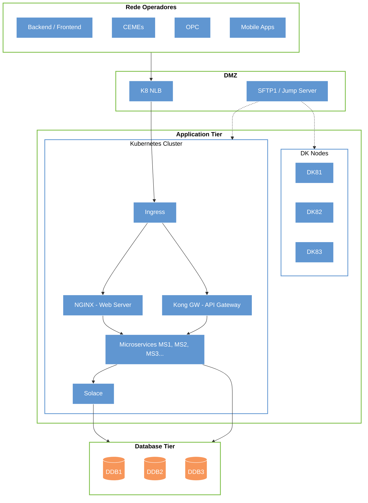
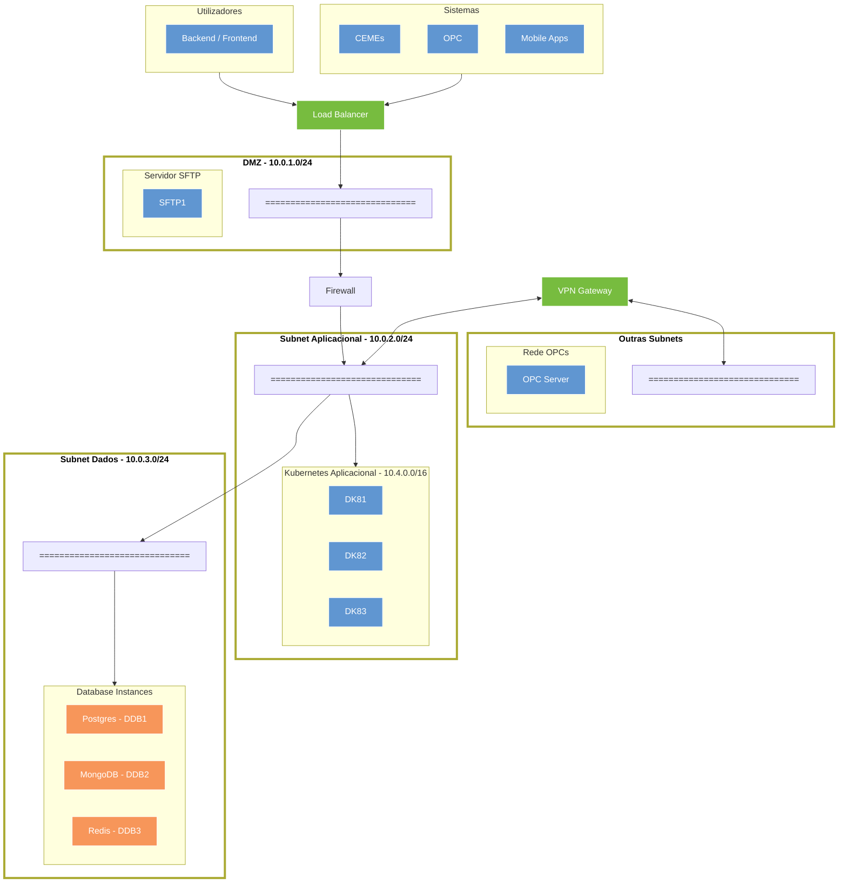
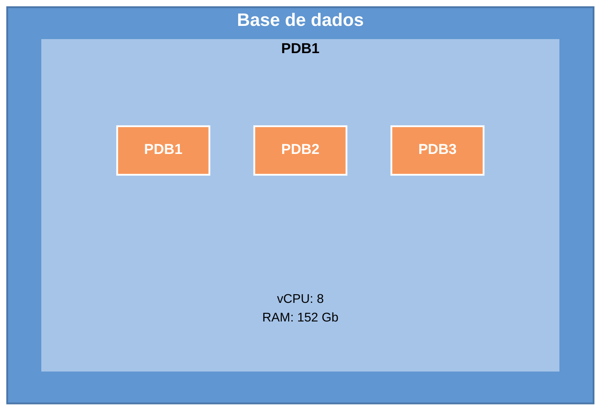
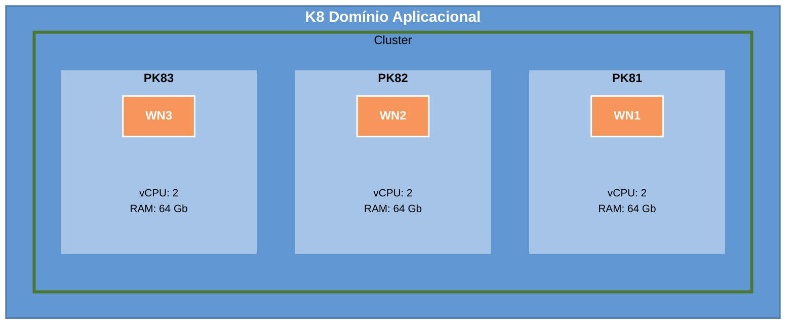

# Mobie Infraestrutura, v1.0

# Arquitectura da Infraestrutura

Document produced by:

**Link Consulting – Tecnologias de Informação, S. A.**

To:

**Mobie**

Project nº MOBIE_26_1529

2026-01-26

# Document Control

## Document information

|  |  |
| --- | --- |
| Project: | MOBIE_26_1529 - Arquitectura da Infraestrutura |
| Document Title: | Mobie Infraestrutura |
| Template: | Especificação de requisitos |
| Author(s): | Paulo Rodrigues |
| Version: | 1.0 |
| Version Date: | 2026-01-26 |
| Information Classification: | Restricted |
| Status: | Draft |

## Revisions History

| Version | Date | By | Changes Description |
| --- | --- | --- | --- |
| 1.0 | 2026-01-26 | Paulo Rodrigues | Document creation. |

**DOCUMENT APPROVALS**

| Approver Name | Project Role | Signature / Electronic Approval | Date |
| --- | --- | --- | --- |
|  |  |  |  |

# Introdução

O principal objetivo deste documento é definir a estrutura básica de todos os componentes de infraestrutura que serão o foco principal do projeto atual.

## Âmbito do documento

Este será um documento de trabalho, onde na primeira versão a informação será fornecida provisoriamente e onde identificaremos também um conjunto de dados que deverão ser recolhidos junto da equipa de infraestruturas da Mobie.

Assim sendo, os principais objetivos deste documento são:

- Identificar todos os componentes de software a instalar.

- Definir e identificar cada servidor (virtual ou físico) que irá alojar cada componente e, ao fazê-lo, identificar também os seus requisitos (CPU, memória, nome da rede e endereços IP).

- Identificar todas as sub-redes propostas para utilização em todos os ambientes, identificando possivelmente também um conjunto de rotas básicas que necessitam de ser garantidas entre elas.

A versão final deste documento fornecerá uma visão clara dos seguintes ambientes:

- Produção

- Desenvolvimento

- Qualidade

Isto incluirá uma descrição detalhada de cada servidor e das portas que se espera estarem em utilização em cada máquina.

## Audiência

O presente documento será relevante para as seguintes funções:

- **Equipa de infraestruturas**, que deve incluir as equipas de Rede, Sistemas e Segurança. Este documento será complementado com os valiosos contributos destas equipas e, no futuro, deverá servir de referência para as mesmas.

- **Equipa Responsável pela instalação da Infraestrutura**, onde a informação aqui contida deverá servir de guia para identificar o que há a ser instalado e onde.

- **Equipa de Gestão de Projeto**, para melhor compreender quais os recursos necessários (Humanos, Hardware e Software), que o projeto irá necessitar para completar com sucesso as tarefas de disponibilizar os diversos ambientes aqui descritos.

## Estrutura do documento

A secção 1, "**Introdução**", apresenta uma visão geral do documento, bem como a audiência e a estrutura do mesmo.

A secção 2, "**Âmbito do projecto**", descreve o âmbito do projeto e os intervenientes envolvidos.

A secção 3, "**Pré-Requisitos de Instalação**", contém os pré-requisitos de instalação que devem ser garantidos antes de iniciar o processo de instalação.

A secção 4, "**Software**", contém uma lista de todos os produtos de software a instalar.

A secção 5, "**Arquitetura Física**", descreve a arquitetura física da solução, focando a descrição no ambiente de Produção.

A secção 6, "**Arquitetura Lógica**", apresenta uma descrição detalhada da arquitetura lógica de cada ambiente.

A secção 7, "**Rede e Segurança**", enumera toda a informação relacionada com a rede necessária para configurar e gerir todos os ambientes.

A secção 8, "**Questões e Esclarecimentos**", refere todos os assuntos pendentes, incluindo questões e pendências relacionadas com os requisitos.

A secção 9, "**Documentos Relacionados**", contém os documentos relacionados utilizados durante a recolha de requisitos.

A secção 10, "**Anexos**", contém referências a dados relevantes utilizados durante a recolha de requisitos.

## Glossário

Esta secção apresenta um glossário detalhado, ordenado alfabeticamente, dos conceitos do domínio de negócio, definindo cada um dos conceitos relevantes para o projeto.

A tabela abaixo identifica definições, termos e acrónimos utilizados ao longo deste documento.

| Item | Descrição |
| --- | --- |
| DMZ | Demilitarized Zone, zona de rede parcialmente exposta ao exterior, utilizada como perímetro de segurança. |
| FQDN | Fully Qualified Domain Name, o nome completo pelo qual a máquina será conhecida na rede. |
| IP | Internet Protocol, endereço numérico que identifica um dispositivo numa rede. |
| OKE | Oracle Kubernetes Engine, serviço gerido de Kubernetes na Oracle Cloud. |
| vCPU | Virtual Central Processing Unit, unidade central de processamento virtual. |
| VCN | Virtual Cloud Network, rede virtual na cloud. |
| VLAN | Virtual LAN, rede local virtual. |

**Tabela 1 – Glossário**

# Âmbito do projecto

Esta secção descreve o âmbito do projeto e define os limites da solução.

## Visão geral do projeto

O presente projeto inclui a instalação e configuração de uma infraestrutura de suporte à Plataforma da Mobie, o que implica a preparação e instalação dos seguintes componentes:

- Kubernetes como plataforma de orquestração de containers

- NGINX como Web Server e Reverse Proxy

- Kong API Gateway + Konga como solução de gestão de APIs

- Keycloak como plataforma de gestão de identidade e autenticação

- Solace como Event Broker

- PostgreSQL como base de dados relacional

- MongoDB como base de dados NoSQL

- Grafana e Prometheus como solução de monitorização e observabilidade

- Istio como service mesh para controlo de comunicações entre microserviços

- vsFTP como servidor de transferência de ficheiros segura

Isto será realizado nos ambientes identificados neste documento: Produção, Qualidade e Desenvolvimento. O uso destes ambientes garante um processo de desenvolvimento adequado e as melhores metodologias de Garantia de Qualidade possíveis.

## Participantes

Esta secção fornece uma lista completa dos principais utilizadores do projeto, que possuem o conhecimento e a autoridade para tomar decisões sobre os requisitos, podendo ter influência direta ou indireta sobre os mesmos.

| Equipa | Nome do Contacto | Descrição | Telemóvel | E-mail |
| --- | --- | --- | --- | --- |
| **Mobie** |  |  |  |  |
| **Link Consulting** | Mario Antunes | Patrocinador Projeto |  | [mario.antunes@linkconsulting.com](mailto:mario.antunes@linkconsulting.com) |
| **Link Consulting** | Patricia Boavida | Gestor Projecto |  | [patricia.boavida@linkconsulting.com](mailto:patricia.boavida@linkconsulting.com) |
| **Link Consulting** | Miguel Ferreira | Responsavel Tecnico |  | [miguel.d.ferreira@linkconsulting.com](mailto:miguel.d.ferreira@linkconsulting.com) |

**Tabela 2 – Participantes**

# Pré-Requisitos de Instalação

Para que os procedimentos de instalação sejam realizados de forma eficaz, devem ser cumpridos alguns requisitos. Descrevemos esses requisitos abaixo.

**Organização da equipa e trabalho**

- O acesso ao ambiente de cloud da infraestrutura será assegurado pela Mobie à equipa da Link. Isto inclui o acesso ao tenant e as permissões para todos os componentes necessários.

- A validação da etapa de instalação será efetuada pela Link. Isto inclui a validação da preparação da infraestrutura (conectividade de rede, memória, CPUs).

- A equipa da Link que irá realizar a instalação e a validação dos produtos deverá ter acesso SSH a todas as máquinas.

- Durante a configuração dos produtos, a equipa da Link deverá ter acesso root a todas as máquinas do projeto.

- Espera-se que a equipa que irá realizar a instalação dos produtos tenha experiência neste tipo de configuração assim, este documento serve como guia e não como manual de instalação.

**Base de dados**

- Espera-se utilizar PostgreSQL como servidor de base de dados relacional e MongoDB como servidor de base de dados NoSQL para suporte ao projeto e a todos os seus componentes.

- A instalação e configuração das bases de dados será realizada pela equipa da Link.

- Em determinadas situações, a equipa da Link poderá necessitar de acesso administrativo às bases de dados para realizar um conjunto de operações durante a instalação dos produtos. Será necessário fornecer esse acesso quando solicitado.

- Os requisitos específicos de configuração de rede e volumes de armazenamento para as bases de dados encontram-se detalhados nas secções de arquitetura deste documento.

**Comentários relacionados com a rede**

- Todas as máquinas instaladas respeitarão os IPs e FQDNs definidos neste documento.

- A ligação entre os vários servidores no mesmo ambiente deve ser garantida ou devem ser concedidos os privilégios necessários para permitir a acessibilidade entre componentes.

- Tudo isto deve ser garantido antes do início do processo de instalação do software.

- Todos os servidores devem ter acesso à internet para obter os pacotes e software necessários. Este acesso à internet poderá ser removido após a correta instalação de todos os pacotes e software nos servidores se assim se decidir ser necessário.

**Observações relacionadas com o hardware**

- A arquitetura proposta assume a utilização de servidores virtuais na cloud, cujas especificações devem ser revistas de acordo com os requisitos e a volumetria esperada para cada componente.

- Os ambientes em cluster assumem um mínimo de dois nós virtuais de forma a garantir a alta disponibilidade do sistema. Assume-se que estas máquinas virtuais serão alojadas em diferentes domínios de falha (Fault Domains).

- Todos os valores de vCPU, memória e armazenamento apresentados são indicativos e deverão ser revistos tendo em conta os requisitos reais do projeto.

**Observações adicionais**

- Todos os custos relacionados com outros tipos de despesas são da responsabilidade do cliente

- Todas as máquinas (virtuais ou físicas) a utilizar na solução respeitarão a informação descrita neste documento.

# Software

## Recomendações

A nossa recomendação é utilizar, sempre que possível, as versões mais recentes e estáveis dos produtos de software envolvidos na solução, de forma a beneficiar das mais recentes funcionalidades e correções de segurança.

Com o objetivo de otimizar o desempenho do sistema e reduzir as dependências entre produtos (importante ao considerar estratégias de patching e atualização), recomendamos que cada produto seja alojado no seu próprio namespace ou cluster Kubernetes dedicado, sempre que possível.

## Pacotes de Sistema Operativo Necessários

As configurações existentes utilizam as seguintes distribuições:

  - Ubuntu 20.04 LTS / Oracle Linux 8

Em todas as situações, espera-se que o Sistema Operativo mantenha os seguintes pacotes adicionais:

- curl

- wget

- apt-transport-https

- ca-certificates

- gnupg

- lsb-release

- net-tools

- nfs-common

- open-iscsi

Para informação adicional, consultar a documentação oficial de cada produto.

## Organização do sistema de ficheiros

Propõe-se que o Sistema Operativo siga a hierarquia de sistema de ficheiros padrão para sistemas Unix, onde são criados alguns pontos de montagem separados para alojar alguns dos seus diretórios, tais como:

| Ponto de Montagem | Tamanho Recomendado | Observações |
| --- | --- | --- |
| / | 100 GB |  |
| /tmp | 20 GB |  |
| /var | 10 GB |  |
| /var/log | 25 GB |  |
| /var/tmp | 20 GB |  |
| /home | 40 GB |  |
| /data | 200 GB | A utilizar para dados das aplicações e volumes persistentes do Kubernetes. |

**Tabela 3 – Organização do sistema de ficheiros**

## Lista de software

As secções seguintes descrevem os diversos produtos a serem instalados na infraestrutura de suporte à Plataforma da MOBIE.

A tabela seguinte soma os produtos necessários a instalar:

| Ferramenta | Descrição |
| --- | --- |
|  Kubernetes | Sistema de orquestração de containers open-source que automatiza o deployment, scalling e a gestão de aplicações em containers. |
|  NGINX | Web server que pode ser usado como reverse proxy, load balancer, mail proxy e HTTP cache. |
|  vsFTP | é um servidor FTP rápido, estável e seguro para sistemas Unix/Linux, sendo a escolha padrão no Ubuntu, CentOS e RHEL |
|  keyCloak | O Keycloak oferece federação de utilizadores, autenticação forte, gestão de utilizadores, autorização granular e muito mais. |
|  Kong API Gateway + Konga | API Gateway open-source, desenvolvido para ambientes cloud e/ou híbridos, otimizado para microserviços e arquiteturas distribuídas. |
|  Solace | Event Broker |
|  PostgreSQL | Base de Dados SQL |
|  MongoDB | Base de Dados NoSQL |
|  Grafana | Aplicação open-source de para análise de dados e visalização sobre o formato de gráficos. |
|  Prometheus | Aplicação open-source de monitorização e alerta de eventos |
|  Istio | Aplicação open-source de monitorização de microserviços e controlo de comunicações entre microserviços |

**Tabela 4 – Lista do software**

# Arquitetura Física

## Arquitetura de Camadas

**Diagrama 1 – Arquitetura de Camadas**

Do diagrama anterior, gostaríamos de salientar os seguintes pontos:

- Assume-se que os postos irão aceder através de uma rede semiprivada aos serviços e aplicações expostos pela componente OCPP da solução. No entanto, este acesso poderá também ser efetuado através de um canal público, e.g. Internet, sem que isso cause problemas ao nível de segurança da solução.

- Os serviços e aplicações expostas serão sempre mediadas pelas camadas de Web Server e API Gateway, na camada de Web Server espera-se disponibilizar todos os conteúdos estáticos necessários ao bom funcionamento das aplicações, e através da API Gateway serão expostos os serviços que irão igualmente dar suporte a essas mesmas aplicações. Na solução proposta, estes componentes serão suportados pelo cluster Kubernetes.

- A camada de acesso à base de dados será exposta apenas aos serviços aplicacionais que necessitem de aceder a dados, e não se prevê a necessidade de permitir o acesso direto das camadas de Web ou API Gateway.

- É previsto instalar grande parte dos sistemas aplicacionais dentro dos clusters de Kubernetes, pelo que a rede interna destes componentes poderá e será segmentada de forma a permitir uma melhor gestão dos acessos a cada um deles

- Espera-se que os componentes Prometheus/Grafana monitorizem apenas o ambiente de Produção, no entanto, isto pode ser alargado para incluir também o ambiente de Desenvolvimento e ou Qualidade, caso seja necessário.

- Será utilizado como um Jump Server que deve ser usado para aceder aos componentes internos, e não expostos, da arquitetura.

- É também importante salientar que todas as redes e sub-redes identificadas devem ser revistas ao nível do projeto, e espera-se que isso seja alterado de acordo com as necessidades e organização própria da rede da Mobie.

## Arquitetura de Rede

O diagrama seguinte apresenta uma abstração resumida das várias sub-redes e servidores que se espera que sejam usados nos ambientes da Mobie.

**Diagrama 2 – Diagrama de rede**

O Diagrama anterior apresenta e enumera os seguintes segmentos de rede:

- **DMZ**, este segmento irá ficar exposto para clientes externos, e será o segmento de rede que irá apresentar um Balanceador de carga que irá redirecionar o tráfico de rede para os correspondentes serviços suportados no Kubernetes. Para além deste serviço de redireccionamento, espera-se que a DMZ tenha também um servidor SFTP aberto a ligações dos diversos operadores.

- **Subnet Aplicacional**, esta área irá suportar o cluster de Kubernetes responsável por suportar todos os principais componentes aplicacionais, nomeadamente os Web Services, a API Gateway, e também os Micros serviços aplicacionais. Para além destes componentes espera-se sejam também aqui disponibilizados os componentes de suporte (e.g. Event Hub, Redis, etc.).

  - Será de salientar que todos os serviços expostos serão sempre acedidos através da API Gateway.

  - Todos os recursos disponíveis às aplicações de Front-End e Back-office serão disponibilizados através do Web Server (NGiNX).

- **Subnet de base de dados**, esta ficará dedicada aos repositórios de dados, sejam estes respeitantes aos módulos aplicacionais ou analíticos. Uma exceção poderá ser implementada no caso do Redis, pois este poderá ser instanciado no Cluster Kubernetes como uma forma de cache

# Arquitetura Lógica

As secções seguintes descrevem os domínios lógicos dos Produtos, com correspondência correspondente com os Pods onde serão implantados. Todos os nomes e designações foram definidos arbitrariamente e devem ser revistos nas fases iniciais do processo de instalação

## Ambiente de Produção

**Diagrama 3 – Produção – Diagrama Lógico – Camada Aplicacional**

O Diagrama anterior propõe uma segmentação lógica dos recursos do cluster Kubernetes em 3 grandes grupos, cada um suportado por mais do que um Worker Nodes de forma a garantir a resiliência dos serviços. É de salientar também que estes Worker Nodes deverão também ser distribuídos por mais do que um Fault Domain.

A segmentação de recursos físicos em grupos lógicos irá permitir reforçar cada um desses grupos caso se torne necessário.

Esta abordagem também é seguida no ambiente de Testes de forma a replicar mais fielmente o ambiente de produção.

**Diagrama 4 – Produção – Diagrama Lógico – Camada Base de dados**

Como o diagrama demonstra, espera-se suportar os diversos motores de base de dados dentro dos mesmos servidores, adotando-se uma arquitetura em cluster para essas configurações.

A tabela seguinte resume a informação apresentada nos diagramas anteriores um formato mais sucinto:

| Servidor | vCPU | Memória | Armazenamento Local | Nota |
| --- | --- | --- | --- | --- |
| PK81 | 6 | 96 GB | 150GB | WorkerNode |
| PK82 | 6 | 96 GB | 150GB | WorkerNode |
| PK83 | 6 | 96 GB | 150GB | WorkerNode |
| PDB1 | 8 | 152GB | 1TB (block storage) | Mongo |
| PDB2 | 8 | 152GB | 1TB (block storage) | Mongo |
| PDB3 | 8 | 152GB | 1TB (block storage) | Mongo |
| PDB4 | 6 | 96 GB | 500GB (block storage) | Postgresql |
| PFTP1 | 1 | 8 GB | 100GB (block storage) | vSFTP |
| PRP1 | 2 | 8 GB | 50GB | Nginx Reverse Proxy |

**Tabela 5 – Produção – Lista de servidores virtuais**

Os valores apresentados são meramente indicativos e devem ser revistos para ter em conta os requisitos e o volume esperado para cada implementação.

## Ambiente de Qualidade

**Diagrama 5 – Qualidade – Diagrama Lógico – Camada Aplicacional**

O Diagrama anterior propõe uma segmentação lógica dos recursos do cluster Kubernetes em 3 grandes grupos, cada um suportado por 3 Worker Nodes de forma a garantir a resiliência dos serviços.

Esta separação será adotada no ambiente de Produção, permitindo no futuro reforçar um grupo específico de funcionalidades aumentando o número de Worker Nodes que lhe está dedicado, ou alterando a sua natureza (aumentando CPU e/ou memória).

**Diagrama 6 – Qualidade – Diagrama Lógico – Camada Base de Dados**

No diagrama acima assume-se uma configuração já idêntica ao que se espera implementar no ambiente de produção. Neste caso, espera-se suportar os diversos motores de base de dados dentro dos mesmos servidores, adoptando-se no entanto uma arquitectura em cluster para essas configurações.

A tabela seguinte resume a informação apresentada nos diagramas anteriores um formato mais sucinto:

| Servidor | vCPU | Memória | Armazenamento Local | Nota |
| --- | --- | --- | --- | --- |
| QK81 | 2 | 64 GB | 100GB | WorkerNode |
| QK82 | 2 | 64 GB | 100GB | WorkerNode |
| QK83 | 2 | 64 GB | 100GB | WorkerNode |
| QDB1 | 4 | 64 GB | 250GB (block storage) | Mongo |
| QDB2 | 4 | 64 GB | 250GB (block storage) | Mongo |
| QDB3 | 4 | 64 GB | 250GB (block storage) | Mongo |
| QDB4 | 1 | 64 GB | 250GB (block storage) | Postgresql |
| QFTP1 | 1 | 8 GB | 50GB (block storage) | vSFTP |
| QRP1 | 1 | 8 GB | 50GB | Nginx Reverse Proxy |

**Tabela 6 – Qualidade – Lista de servidores virtuais**

Os valores apresentados são apenas indicativos e deverão ser revistos de forma a contemplar os requisitos e a volumetria esperada para cada um dos repositórios de dados.

## Ambiente de Desenvolvimento

**Diagrama 7 – Desenvolvimento – Diagrama Lógico – Camada Aplicacional**

O Cluster Kubernetes será suportado por uma única Node Pool, assumindo-se que todos os componentes e Micro Serviços serão distribuídos e balanceados pelos recursos existentes.

**Diagrama 8 – Desenvolvimento – Diagrama Lógico – Camada Base de Dados**

No diagrama acima assume-se que no ambiente de desenvolvimento os diversos motores de base de dados serão suportados sobre um único servidor virtual.

A tabela seguinte resume a informação apresentada nos diagramas anteriores um formato mais sucinto:

| Servidor | vCPU | Memória | Armazenamento Local | Nota |
| --- | --- | --- | --- | --- |
| DK81 | 2 | 16 GB | 150GB | WorkerNode |
| DK82 | 2 | 16 GB | 150GB | WorkerNode |
| DK83 | 2 | 16 GB | 150GB | WorkerNode |
| DDB1 | 2 | 32 GB | 100GB (block storage) | Mongo |
| DDB2 | 2 | 32 GB | 100GB (block storage) | Mongo |
| DDB3 | 2 | 32 GB | 100GB (block storage) | Mongo |
| DDB4 | 1 | 16 GB | 250GB (block storage) | Postgresql |

**Tabela 7 – Desenvolvimento – Lista de servidores virtuais**

Os valores apresentados são apenas indicativos e deverão ser revistos de forma a contemplar os requisitos e a volumetria esperada para cada um dos repositórios de dados.

# Rede e Segurança

## Perfis de servidor e Portos utilizados

A tabela seguinte discrimina os diversos produtos e componentes identificados para serem instalados e usados na solução proposta, e também os diversos portos que se espera utilizar.

| Servidor | Produto | Perfil de Servidor | Portos a utilizar |
| --- | --- | --- | --- |
| K81 | Kubernetes | Kubernetes |  |
| K82 | Kubernetes | Kubernetes |  |
| K83 | Kubernetes | Kubernetes |  |
| DB1 + DB2 + DB3 | MongoDB | Servidor de Base de Dados NoSQL | 27017; 27018; 27019 |
| DB4 | Postgres | Servidor de Base de Dados SQL | 5432 |
| PFTP1 | vSFTP | Servidor de SFTP |  |
| PRP1 | NginX Reverse Proxy | Reverse Proxy |  |

**Tabela 8 – Servidores Aplicacionais e Portos**

Os portos identificados nesta tabela deverão ser tidos em conta na instanciação de todos os ambientes da infraestrutura.

Será de salientar que nos ambientes de desenvolvimento não se irá separar as diferentes bases de dados por diversos servidores.

O servidor de Redis poderá, em alternativa, ser instalado como um componente fora da infraestrutura de Kubernetes.

## Nomenclatura de Servidores

Os critérios e requisitos base para a nomenclatura a adotar são:

- Identificar claramente o ambiente a que a máquina pertence

- Identificar que funcionalidade ou objetivo tem

- Incluir uma componente numérica que permita distinguir mais do que um servidor do mesmo tipo dentro do mesmo ambiente

Propõem-se então a seguinte taxonomia a adotar na nomeação de máquinas e servidores:

- Prefixo de tipo:

  - M – para indicação de máquina virtual

- Infixo de ambiente:

  - PRD – para ambiente de produção

  - QUA – para ambiente de Testes/qualidade

  - DEV – para ambiente de Desenvolvimento

- Infixo de Função:

  - DB – para máquinas destinadas a Base de Dados

  - FTP – para máquinas destinadas a servidores FTP

- Sufixo numérico que permita distinguir máquinas do mesmo tipo e do mesmo ambiente.

  - Deverá adotar-se valores numéricos representados por dois dígitos, sendo a primeira máquina representada por 01.

A título de exemplo, teremos os seguintes:

- M-PRD-DB01, Máquina de base de dados do ambiente de produção.

- M-QUA-FTP01, Máquina de servidor FTP/SFTP do ambiente de qualidade.

Estas nomenclaturas serão aplicadas sempre que possível, excetuando-se à partida os servidores e máquinas instanciados pelos processos automáticos de gestão da cloud e do Kubernetes (OKE).

## Rede de gestão

Por razões de segurança e resiliência, recomenda-se a existência de redes adicionais e separadas para suportar tráfego de rede específico. Solicita-se, portanto, que todos os servidores sejam configurados com, pelo menos, duas interfaces de rede:

- **Rede Aplicacional**, que é o foco principal deste documento e será a interface principal através da qual os utilizadores e serviços acedem à solução.

- **Rede de Gestão**, esta interface será dedicada às consolas de administração dos produtos instalados e deverá ser também a única interface para quaisquer interfaces de shell (sshd). Sugere-se ter uma única rede de gestão para todas as máquinas da solução e, por razões de segurança, deverá estar completamente separada de todas as outras redes. Apenas utilizadores autorizados devem ter acesso a esta rede, sendo o acesso geral negado. O acesso VPN deverá utilizar esta rede.

As seguintes considerações deverão ser tidas em conta na conceção e configuração desta rede:

  - Recomenda-se a utilização de uma VLAN separada, por razões de segurança.

  - A rede ligará todas as máquinas, e o mesmo deverá ser considerado para todos os outros ambientes. A conectividade entre ambientes não é recomendada, nem mesmo ao nível da rede de gestão.

  - O acesso a esta rede deverá ser controlado de forma rigorosa, uma vez que permite acesso a todas as máquinas do ambiente.

  - O acesso à rede deverá ser garantido por dois meios possíveis:

    - Configurar um "**Jump Server**" com acesso a ambas as redes (Gestão e rede interna da Mobie), controlar o acesso a este Jump Server e exigir que qualquer Administrador de Sistema que pretenda aceder ao sistema utilize primeiro este servidor.

    - Configurar um conjunto de regras de encaminhamento de rede que permitam a utilizadores/máquinas específicos aceder à rede de gestão. Isto pode ser conseguido máquina a máquina, ou, se os Administradores de Sistema se encontrarem numa subnet especial, configurando regras de rede de subnet para subnet.

## Requisitos de Rede

A estrutura e organização de redes proposta assume que cada segmento será utilizado unicamente para o fim proposto.

### Ambiente de Produção

As seguintes subsecções enumeram todas as configurações e definições relacionadas com as configurações de rede do presente ambiente.

**Segmentos de Rede**

| Descrição | Subnet |
| --- | --- |
| VCN NP_PRD | 10.201.0.0/16 |
| Subnet DMZ – PRD | 10.201.1.0/24 |
| Subnet Aplicacional – PRD | 10.201.2.0/24 |
| Subnet Database – PRD | 10.201.3.0/24 |

**Tabela 9 – Segmentos de Rede**

**Configurações de Rede dos Diversos Servidores**

| Servidor | FQDN | IP |
| --- | --- | --- |
| PK801 | Auto | Automatically assigned |
| PK802 | Auto | Automatically assigned |
| PK803 | Auto | Automatically assigned |

**Tabela 10 – Configurações de rede dos Servidores**

**Configurações de Balanceadores de Rede e VIPs**

| Nome do cluster | Front-End DNS | Front-End IP | Servidores no Cluster |
| --- | --- | --- | --- |
|  |  |  |  |

**Tabela 11 – Configurações de Balanceadores e VIPs**

**Outras configurações de rede:**

| Parametro | Valor |
| --- | --- |
| Primary DNS |  |
| NTP Server |  |

**Tabela 12 – Outras configurações de rede**

**Configurações de Rotas e Firewalls:**

| Aplicacional/Gestão | Ip Origem | IP Destino (IP:Port1/…/PortN) |
| --- | --- | --- |
|  |  |  |

**Tabela 13 – Configurações de Firewall e Rotas**

### Ambiente de Qualidade

As seguintes subsecções enumeram todas as configurações e definições relacionadas com as configurações de rede do presente ambiente.

**Segmentos de Rede**

| Descrição | Subnet |
| --- | --- |
| VCN NP_QUA  | 10.101.0.0/16 |
| Subnet DMZ – QUA | 10.101.1.0/24 |
| Subnet Aplicacional – QUA | 10.101.2.0/24 |
| Subnet Database – QUA | 10.101.3.0/24 |

**Tabela 14 – Segmentos de Rede**

**Configurações de Rede dos Diversos Servidores**

| Servidor | FQDN | IP |
| --- | --- | --- |
| QK801 | Auto | Automatically assigned |
| QK802 | Auto | Automatically assigned |
| QK803 | Auto | Automatically assigned |

**Tabela 15 – Configurações de rede dos Servidores**

**Configurações de Balanceadores de Rede e VIPs**

| Nome do cluster | Front-End DNS | Front-End IP | Servidores no Cluster |
| --- | --- | --- | --- |
|  |  |  |  |

**Tabela 16 – Configurações de Balanceadores e VIPs**

**Outras configurações de rede:**

| Parametro | Valor |
| --- | --- |
| Primary DNS |  |
| NTP Server |  |

**Tabela 17 – Outras configurações de rede**

**Configurações de Rotas e Firewalls:**

| Aplicacional/Gestão | Ip Origem | IP Destino (IP:Port1/…/PortN) |
| --- | --- | --- |
|  |  |  |

**Tabela 18 – Configurações de Firewall e Rotas**

### Ambiente de Desenvolvimento

As seguintes subsecções enumeram todas as configurações e definições relacionadas com as configurações de rede do presente ambiente.

**Segmentos de Rede**

| Descrição | Subnet |
| --- | --- |
| VCN NP_DEV | 10.1.0.0/16 |
| Subnet DMZ – DEV | 10.1.1.0/24 |
| Subnet Aplicacional – DEV | 10.1.2.0/24 |
| Subnet Database – DEV | 10.1.3.0/24 |

**Tabela 19 – Segmentos de Rede**

**Configurações de Rede dos Diversos Servidores**

| Servidor | FQDN | IP |
| --- | --- | --- |
| DK801 | Auto | Automatically assigned |
| DK802 | Auto | Automatically assigned |
| DK803 | Auto | Automatically assigned |

**Tabela 20 – Configurações de rede dos Servidores**

**Configurações de Balanceadores de Rede e VIPs**

| Nome do cluster | Front-End DNS | Front-End IP | Servidores no Cluster |
| --- | --- | --- | --- |
|  |  |  |  |

**Tabela 21 – Configurações de Balanceadores e VIPs**

**Outras configurações de rede:**

| Parametro | Valor |
| --- | --- |
| Primary DNS |  |
| NTP Server |  |

**Tabela 22 – Outras configurações de rede**

**Configurações de Rotas e Firewalls:**

| Aplicacional/Gestão | Ip Origem | IP Destino (IP:Port1/…/PortN) |
| --- | --- | --- |
|  |  |  |

**Tabela 23 – Configurações de Firewall e Rotas**

# Questões e Esclarecimentos

Esta secção refere todos os assuntos pendentes, incluindo questões e pendências relacionadas com os requisitos.

|  |  |
| --- | --- |
| Data |  |
| Questão |  |
| Interveniente |  |
| Esclarecimento |  |

|  |  |
| --- | --- |
| Data |  |
| Questão |  |
| Interveniente |  |
| Esclarecimento |  |

|  |  |
| --- | --- |
| Data |  |
| Questão |  |
| Interveniente |  |
| Esclarecimento |  |

# Documentos Relacionados

Nesta secção encontram-se catalogados todos os documentos utilizados como referência para o design da arquitetura.

| ID | Nome do Documento | Data do Documento | Descrição |
| --- | --- | --- | --- |
|  |  |  |  |

# Anexos

