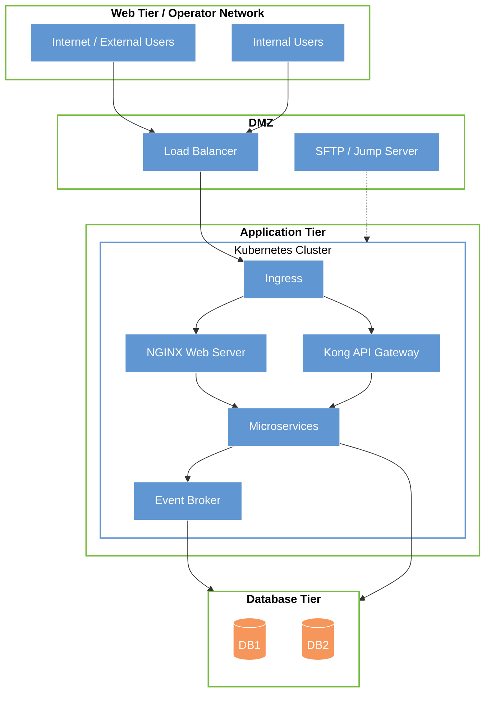
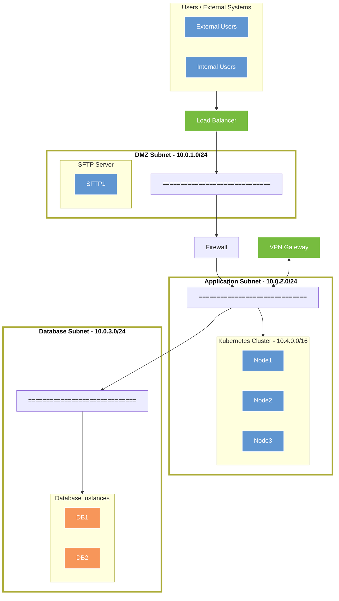
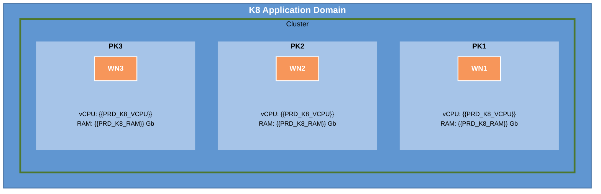
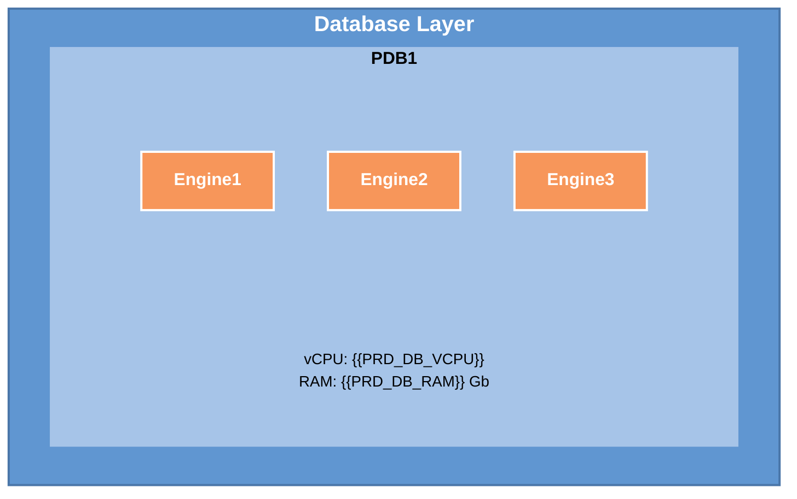
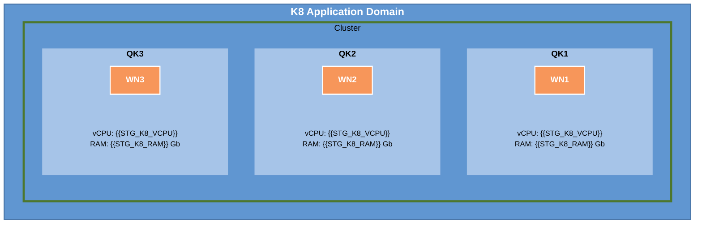
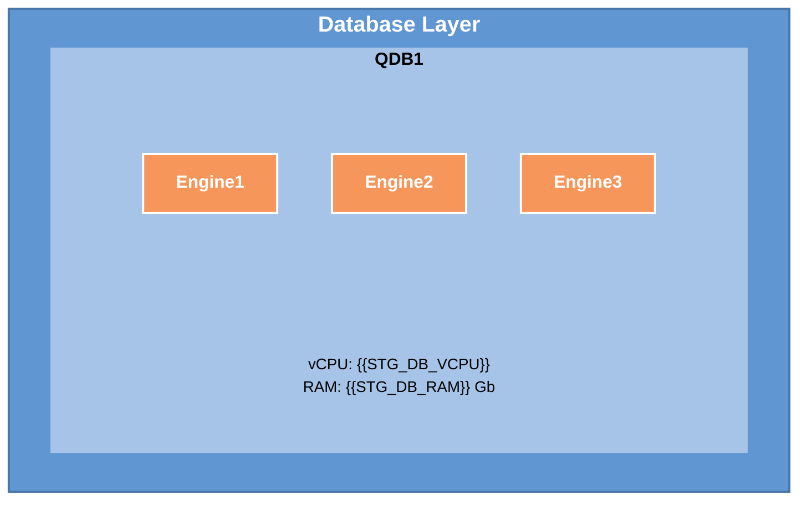
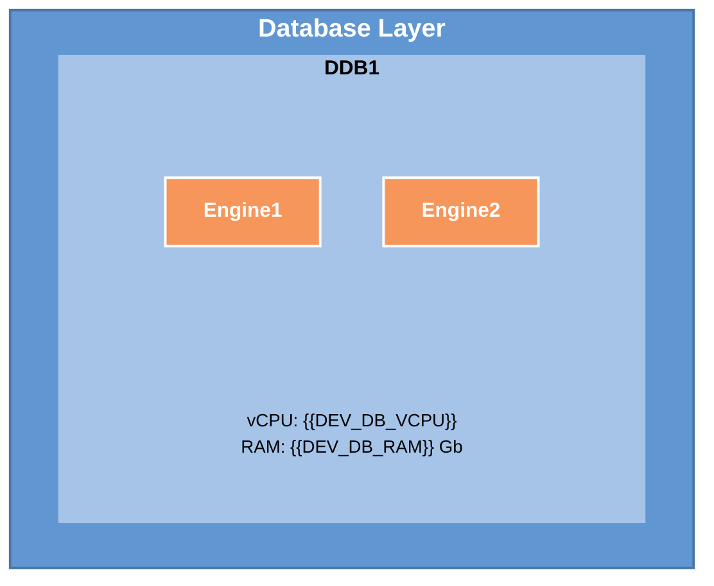

<style>
  .brand-color {
    color: #E36C0A;
  }
</style>

# Infrastructure Design, {{VERSION}}

# {{PROJECT_TITLE}}

Document produced by:

**Link Consulting – Tecnologias de Informação, S. A.**

To:

**{{CLIENT_NAME}}**

Project nº {{PROJECT_ID}}

{{DOCUMENT_DATE}}

# <span class="brand-color">Document Control</span>

## Document Information

|  |  |
| --- | --- |
| Project: | {{PROJECT_ID}} - {{PROJECT_TITLE}} |
| Document Title: | Infrastructure Design |
| Template: | Infrastructure Design Template v1.0 |
| Author(s): | {{AUTHOR_NAME}} |
| Version: | {{VERSION}} |
| Version Date: | {{DOCUMENT_DATE}} |
| Information Classification: | Restricted |
| Status: | Draft |

## Revisions History

| Version | Date | By | Changes Description |
| --- | --- | --- | --- |
| 1.0 | {{DOCUMENT_DATE}} | {{AUTHOR_NAME}} | Document creation. |

**DOCUMENT APPROVALS**

| Approver Name | Project Role | Signature / Electronic Approval | Date |
| --- | --- | --- | --- |
|  |  |  |  |

# <span class="brand-color">Introduction</span>

This document describes the technical architecture and infrastructure design specification for the {{PROJECT_TITLE}} project.

## <span class="brand-color">Document Scope</span>

The current document's goal is to identify and specify all software components to be installed, along with a macro definition of all servers to be provisioned.

This will be a working document, where on the first version the information will tentatively be provided and where we will also identify a set of data that must be gathered from the {{CLIENT_NAME}} infrastructure team.

Therefore, the main objectives for this document are:

- Identify all software components to be installed.

- Define and identify each server (virtual or otherwise) that will host each component, and by doing so, identify also their requirements (CPU, Memory, Storage, network name and IP addresses).

- Identify all proposed VLANs and subnets to be used by all environments, possibly identifying also a set of base routings needed to be guaranteed between them.

The final version of this document will provide a clear picture of the following environments:

- Production

- Staging / Quality

- Development

This will include a detailed description of each server, and the ports that are expected to be in use on each machine.

## <span class="brand-color">Audience</span>

The current document will be relevant to the following roles:

- **Infrastructure team**, this should include Network, Systems and Security teams. The present document will be completed with their valuable input, and in the future this document should also be used as reference by these teams.

- **Project Software Installation team**, as a guide on what needs to be installed and where.

- **Project management team**, to understand the necessary resources (software and hardware) that the project will need for the installation to be successfully concluded.

## <span class="brand-color">Document Structure</span>

Section 1, "**Introduction**", offers the overview of this document as well as audience and structure.

Section 2, "**Project Scope**", describes the scope for carrying out the project and stakeholders involved.

Section 3, "**Installation Pre-Requirements**", contains the installation pre-requirements that must be guaranteed before starting the installation effort.

Section 4, "**Software Products**", contains a list of all software products to be installed.

Section 5, "**Physical Architecture**", describes the solution physical architecture focusing the description on the Production environment.

Section 6, "**Logical Architecture**", presents a detailed description of the logical architecture of each environment.

Section 7, "**Security and Network**", enumerates all the network related information needed to configure and manage all environments.

Section 8, "**Questions and Clarifications**", refers to all pending matters, including questions and pending issues related to requirements.

Section 9, "**Related Documents**", contains related documents used during requirements gathering.

Section 10, "**Attachments**", contains references to relevant related data used during requirements gathering.

## <span class="brand-color">Glossary</span>

This section provides a detailed, alphabetically ordered glossary of the business domain, defining each and every one of the business concepts relevant to the project.

The table below identifies definitions, terms, and acronyms used throughout this document.

| Item | Description |
| --- | --- |
| DMZ | Demilitarized Zone, a network area partially exposed to the outside, used as a security perimeter. |
| FQDN | Fully Qualified Domain Name, the complete name for which the machine will be known in the network. |
| vCPU | Virtual Central Processing Unit. |
| VLAN | Virtual LANs. |
| VPN | Virtual Private Network. |

<span class="brand-color">**Table 1 – Glossary**</span>

# <span class="brand-color">Project Scope</span>

This section describes the scope of the project and sets the boundaries of the solution.

## <span class="brand-color">Project Overview</span>

The current project includes the setup of an infrastructure, and that means preparing and installing the following components:

- {{SOFTWARE_COMPONENT_1}}

- {{SOFTWARE_COMPONENT_2}}

- {{SOFTWARE_COMPONENT_3}}

This will be done within the identified environments, since the development environment details are also described in this document. The use of these environments ensures a proper development procedure and the best possible Quality Assurance methodologies.

## <span class="brand-color">Participants</span>

This section provides a complete list of key users for the project with knowledge and authority to make decisions about requirements that may have a direct or indirect influence on the requirements.

| Team | Contact Name | Description | Phone | E-mail |
| --- | --- | --- | --- | --- |
| **{{CLIENT_TEAM}}** | {{CLIENT_NAME}} | {{CLIENT_ROLE}} | [{{CLIENT_PHONE_PRETTY}}](tel:{{CLIENT_PHONE}}) | [{{CLIENT_EMAIL}}](mailto:{{CLIENT_EMAIL}}) |
| **Link Consulting** | {{LINK_PS_NAME}} | Project Sponsor | [{{LINK_PS_PHONE_PRETTY}}](tel:{{LINK_PS_PHONE}}) | [{{LINK_PS_EMAIL}}](mailto:{{LINK_PS_EMAIL}}) |
| **Link Consulting** | {{LINK_PM_NAME}} | Project Manager | [{{LINK_PM_PHONE_PRETTY}}](tel:{{LINK_PM_PHONE}}) | [{{LINK_PM_EMAIL}}](mailto:{{LINK_PM_EMAIL}}) |
| **Link Consulting** | {{LINK_TL_NAME}} | Technical Lead | [{{LINK_TL_PHONE_PRETTY}}](tel:{{LINK_TL_PHONE}}) | [{{LINK_TL_EMAIL}}](mailto:{{LINK_TL_EMAIL}}) |

<span class="brand-color">**Table 2 – Participants**</span>

# <span class="brand-color">Installation Pre-Requirements</span>

In order for the installation procedures to be conducted effectively, there are some requirements that must be fulfilled. We describe them below.

**Team and work organization**

- Access to the infrastructure environment will be ensured by {{CLIENT_NAME}} to the Link team. This includes access to the tenant and permissions for all necessary components.

- The validation of the installation stage will be conducted by Link. This includes the validation of the infrastructure preparation (network connectivity, memory, CPUs).

- The Link team that will perform the installation and validation of the products will have to be granted SSH access to all machines.

- While setting up the products, the Link team shall be granted root access on all project machines.

- It is expected that the team performing the products installation is experienced in this type of setup, therefore this document is to serve as a guideline and not an installation manual.

**Database**

- It is expected to use {{DB_PRODUCTS}} as the main database server(s) for the entire project and all products.

- The database installation and configuration will be performed by Link team.

- On some key occasions, Link team will require administrative access to the databases to perform a select number of operations during the products installation.

- The specific network configuration and storage volume requirements for the databases are detailed in the architecture sections of this document.

**Network Related Remarks**

- All installed machines will respect the IPs and FQDNs to be defined in the present document.

- All FQDNs, and their respective IP addresses, must be registered in the network DNS.

- Connection between the several servers in the same environment is guaranteed.

- All this should be guaranteed before the software installation process starts.

- All servers should have internet access to obtain necessary packages and software.

**Hardware Related Remarks**

- The proposed architecture assumes the use of virtual servers in the cloud, whose specifications must be reviewed according to the requirements and expected workload for each component.

- The proposed clustered environments assume a minimum of two virtual servers in order to guarantee system high availability. It is assumed that these virtual machines are to be hosted on different fault domains.

- All vCPU, memory and storage values presented are indicative and should be reviewed taking into account the actual project requirements.

**Additional Remarks**

- All costs related to other types of expenses are the responsibility of the client.

- All machines (virtual or otherwise) to be used in the solution will respect the information described in the present document.

# <span class="brand-color">Software Products</span>

## <span class="brand-color">Recommendations</span>

Our recommendation is to use, wherever possible, the latest stable versions of the software products involved in the solution in order to benefit from the latest features and security fixes.

In order to optimize system performance and resources and to reduce the dependencies between products (important when considering patching and upgrade strategies), we recommend each product to be hosted on its own namespace or dedicated Kubernetes cluster whenever possible.

## <span class="brand-color">OS Required Packages</span>

The existing configurations use the following distributions:

  - {{OS_DISTRIBUTION}}

In all situations, it is expected that the Operating System should keep the following additional packages:

- {{OS_PACKAGE_1}}

- {{OS_PACKAGE_2}}

- {{OS_PACKAGE_3}}

For further information, please refer to the official documentation of each product.

## <span class="brand-color">File System Organisation</span>

We propose that the Operating System should follow the standard Filesystem hierarchy for Unix file systems, where a few separate mount points are created to host some of its directories, such as:

| Mount Point | Recommended Size | Remarks |
| --- | --- | --- |
| / | 100 GB |  |
| /tmp | 20 GB |  |
| /var | 10 GB |  |
| /var/log | 25 GB |  |
| /var/tmp | 20 GB |  |
| /home | 40 GB |  |
| /data | 200 GB | To be used for application data and Kubernetes persistent volumes. |

<span class="brand-color">**Table 3 – File System Organisation**</span>

## <span class="brand-color">Software List</span>

The following sections describe the software products to be installed as part of the {{PROJECT_TITLE}} infrastructure.

The following table summarises the required products to be installed:

| Tool | Description |
| --- | --- |
| {{SOFTWARE_1_NAME}} | {{SOFTWARE_1_DESCRIPTION}} |
| {{SOFTWARE_2_NAME}} | {{SOFTWARE_2_DESCRIPTION}} |
| {{SOFTWARE_3_NAME}} | {{SOFTWARE_3_DESCRIPTION}} |

<span class="brand-color">**Table 4 – Software List**</span>

# <span class="brand-color">Physical Architecture</span>

## <span class="brand-color">Layer Architecture</span>



<span class="brand-color">**Diagram 1 – Layer Architecture**</span>

From the previous diagram we would highlight the following points:

- The Web Tier represents the entry point for all users and external systems. Traffic is always mediated through a Load Balancer that handles SSL termination and traffic distribution.

- The Application Tier hosts all application components within a Kubernetes cluster. The Ingress controller routes traffic to the appropriate services via the Web Server and API Gateway.

- The Database Tier is only accessible from the Application Tier services, ensuring security and isolation of data.

- A Jump Server / SFTP server is available in the DMZ for administrative and file transfer operations.

## <span class="brand-color">Network Architecture</span>

The following diagram depicts a summarized abstraction of the several subnets and servers that are expected to be used across all environments.



<span class="brand-color">**Diagram 2 – Network Architecture**</span>

The depicted diagram shows the following network segments:

- **DMZ**, this segment will be exposed to external clients and will host the Load Balancer that redirects network traffic to the corresponding services supported in Kubernetes. A SFTP server will also be available in this segment.

- **Application Subnet**, this area will host the Kubernetes cluster responsible for all main application components, including Web Services, API Gateway, and Microservices.

- **Database Subnet**, this network will be dedicated to the database repositories.

# <span class="brand-color">Logical Architecture</span>

The following sections describe the product logical domains, with a matched correspondence with the Virtual Servers where they will be installed. All names and designations were arbitrarily defined, and must be revised on the early stages of the installation process.

## <span class="brand-color">Production Environment</span>



<span class="brand-color">**Diagram 3 – Production – Logical Diagram – Application Layer**</span>

The previous diagram proposes a logical segmentation of Kubernetes cluster resources into worker nodes to ensure service resilience. These Worker Nodes should also be distributed across more than one Fault Domain.



<span class="brand-color">**Diagram 4 – Production – Logical Diagram – Database Layer**</span>

The following table resumes the information depicted on the previous diagrams in a more succinct form:

| Server | vCPU | Memory | Local Storage | Note |
| --- | --- | --- | --- | --- |
| PK1 | {{PRD_K8_VCPU}} | {{PRD_K8_RAM}} GB | {{PRD_K8_DISK}} GB | Worker Node |
| PK2 | {{PRD_K8_VCPU}} | {{PRD_K8_RAM}} GB | {{PRD_K8_DISK}} GB | Worker Node |
| PK3 | {{PRD_K8_VCPU}} | {{PRD_K8_RAM}} GB | {{PRD_K8_DISK}} GB | Worker Node |
| PDB1 | {{PRD_DB_VCPU}} | {{PRD_DB_RAM}} GB | {{PRD_DB_DISK}} GB (block storage) | {{PRD_DB1_ENGINE}} |
| PDB2 | {{PRD_DB_VCPU}} | {{PRD_DB_RAM}} GB | {{PRD_DB_DISK}} GB (block storage) | {{PRD_DB2_ENGINE}} |
| PFTP1 | 1 | 8 GB | 100 GB | SFTP Server |
| PRP1 | 2 | 8 GB | 50 GB | Reverse Proxy |

<span class="brand-color">**Table 5 – Production – Virtual Server List**</span>

The values presented are indicative and should be reviewed to take into account the actual project requirements and expected workload.

## <span class="brand-color">Staging / Quality Environment</span>



<span class="brand-color">**Diagram 5 – Staging/Quality – Logical Diagram – Application Layer**</span>



<span class="brand-color">**Diagram 6 – Staging/Quality – Logical Diagram – Database Layer**</span>

The following table resumes the information depicted on the previous diagrams in a more succinct form:

| Server | vCPU | Memory | Local Storage | Note |
| --- | --- | --- | --- | --- |
| QK1 | {{STG_K8_VCPU}} | {{STG_K8_RAM}} GB | {{STG_K8_DISK}} GB | Worker Node |
| QK2 | {{STG_K8_VCPU}} | {{STG_K8_RAM}} GB | {{STG_K8_DISK}} GB | Worker Node |
| QK3 | {{STG_K8_VCPU}} | {{STG_K8_RAM}} GB | {{STG_K8_DISK}} GB | Worker Node |
| QDB1 | {{STG_DB_VCPU}} | {{STG_DB_RAM}} GB | {{STG_DB_DISK}} GB (block storage) | {{STG_DB1_ENGINE}} |
| QDB2 | {{STG_DB_VCPU}} | {{STG_DB_RAM}} GB | {{STG_DB_DISK}} GB (block storage) | {{STG_DB2_ENGINE}} |
| QFTP1 | 1 | 8 GB | 50 GB | SFTP Server |
| QRP1 | 1 | 8 GB | 50 GB | Reverse Proxy |

<span class="brand-color">**Table 6 – Staging/Quality – Virtual Server List**</span>

The values presented are indicative and should be reviewed to take into account the actual project requirements and expected workload.

## <span class="brand-color">Development Environment</span>


<span class="brand-color">**Diagram 7 – Development – Logical Diagram – Application Layer**</span>

The Kubernetes cluster will be supported by a single Node Pool, assuming that all components and Microservices will be distributed and balanced across the existing resources.



<span class="brand-color">**Diagram 8 – Development – Logical Diagram – Database Layer**</span>

In the development environment, the various database engines will be supported on a single virtual server.

The following table resumes the information depicted on the previous diagrams in a more succinct form:

| Server | vCPU | Memory | Local Storage | Note |
| --- | --- | --- | --- | --- |
| DK1 | {{DEV_K8_VCPU}} | {{DEV_K8_RAM}} GB | {{DEV_K8_DISK}} GB | Worker Node |
| DK2 | {{DEV_K8_VCPU}} | {{DEV_K8_RAM}} GB | {{DEV_K8_DISK}} GB | Worker Node |
| DK3 | {{DEV_K8_VCPU}} | {{DEV_K8_RAM}} GB | {{DEV_K8_DISK}} GB | Worker Node |
| DDB1 | {{DEV_DB_VCPU}} | {{DEV_DB_RAM}} GB | {{DEV_DB_DISK}} GB (block storage) | {{DEV_DB1_ENGINE}} |
| DDB2 | {{DEV_DB_VCPU}} | {{DEV_DB_RAM}} GB | {{DEV_DB_DISK}} GB (block storage) | {{DEV_DB2_ENGINE}} |

<span class="brand-color">**Table 7 – Development – Virtual Server List**</span>

The values presented are indicative and should be reviewed to take into account the actual project requirements and expected workload.

# <span class="brand-color">Security and Network</span>

## <span class="brand-color">Server Roles and Ports Used</span>

The following table resumes the purpose of each server and identifies the expected network ports to be used.

| Server | Product | Server Profile | Ports to be used |
| --- | --- | --- | --- |
| K1 / K2 / K3 | Kubernetes | Kubernetes Worker Node |  |
| DB1 | {{DB1_ENGINE}} | {{DB1_TYPE}} Database Server | {{DB1_PORTS}} |
| DB2 | {{DB2_ENGINE}} | {{DB2_TYPE}} Database Server | {{DB2_PORTS}} |
| FTP1 | SFTP | SFTP Server |  |
| RP1 | NGINX Reverse Proxy | Reverse Proxy |  |

<span class="brand-color">**Table 8 – Application Servers and Ports**</span>

The ports identified in this table should be taken into account when instantiating all infrastructure environments.

## <span class="brand-color">Server Naming Convention</span>

The base criteria and requirements for the naming convention to be adopted are:

- Clearly identify the environment to which the machine belongs.

- Identify what functionality or purpose it has.

- Include a numeric component that allows distinguishing more than one server of the same type within the same environment.

The following taxonomy is proposed for naming machines and servers:

- Type prefix:

  - M – to indicate a virtual machine

- Environment infix:

  - PRD – for production environment

  - STG / QUA – for staging / quality environment

  - DEV – for development environment

- Function infix:

  - DB – for machines intended for databases

  - FTP – for machines intended for SFTP servers

  - RP – for machines intended for reverse proxy

- Numeric suffix to distinguish machines of the same type and same environment.

  - Numeric values represented by two digits should be adopted, with the first machine represented by 01.

As examples:

- M-PRD-DB01, Production environment database machine.

- M-STG-FTP01, Staging environment SFTP server machine.

These naming conventions will be applied whenever possible, except where servers and machines are instantiated by automatic cloud and Kubernetes management processes.

## <span class="brand-color">Management Network</span>

For security and resilience reasons, it is recommended to have additional and separate networks to support specific network traffic. It is therefore requested that all servers be configured with at least two network interfaces:

- **Application Network**, which is the main focus of this document and will be the main interface through which users and services access the solution.

- **Management Network**, this interface will be dedicated to the Administration Consoles of the installed products and it should also be considered to be the sole interface for any shell related interfaces (sshd). It is suggested to have a single Management network for all solution machines, and due to security reasons it should be completely separated from all other networks. Only authorized users should be allowed access to this network, and general access should be denied. VPN access should use this network.

```mermaid
graph TD
    %% Global Styling
    classDef subnet stroke-width:4px,fill:#fff,color:#000,font-weight:bold;
    classDef management fill:#FF0000,stroke:#8B0000,stroke-width:3px,color:#fff;
    classDef appSrv fill:#6096d1,stroke:#fff,color:#fff;
    classDef db fill:#f7965a,stroke:#fff,color:#fff;
    classDef admin fill:#fff,stroke:#6096d1,stroke-width:2px,color:#000;

    %% Admin Access
    subgraph Admin_Access [Admin Access Layer]
        SysAdmins[SysAdmins Laptop]
        Client_WAN[{{CLIENT_NAME}} WAN]
    end

    %% Management Backbone
    MGT_VLAN[[Management Subnet VLAN]]

    %% Application Tier
    subgraph App_Tier [Application Tier]
        direction LR
        K8_Nodes[K8 Nodes]
        DB_Nodes[Database Nodes]
        SFTP_Node[SFTP Node]
    end

    %% Management Flows
    SysAdmins -- SSH/VPN --> MGT_VLAN
    Client_WAN -.-> MGT_VLAN

    MGT_VLAN ==> K8_Nodes
    MGT_VLAN ==> DB_Nodes
    MGT_VLAN ==> SFTP_Node

    %% Application Data Path
    K8_Nodes --- App_Line[Application Subnet]
    App_Line --- DB_Line[Database Subnet]
    DB_Line --- DB_Nodes

    %% Applying Classes
    class App_Tier,Admin_Access subnet;
    class MGT_VLAN management;
    class K8_Nodes,SFTP_Node appSrv;
    class DB_Nodes db;
    class SysAdmins,Client_WAN admin;
```

<span class="brand-color">**Diagram 9 – Application, Management & Network Organisation**</span>

The following should be considered while designing and setting up the Management network:

- It is advised to have a separate VLAN, for security reasons.

- The network will connect all machines, and the same should be considered for all other environments. Connectivity between environments is not recommended, not even at Management network level.

- Access to this network should be tightly controlled, since it allows access to all machines in the environment.

- Access to the network should be granted by two possible means:

  - Prepare a "**Jump Server**" that has access to both networks (Management and {{CLIENT_NAME}} internal network), control access to this Jump Server and require that any System Administrator wishing to access the system uses this server first.

  - Configure a set of network routing rules that allow specific users/machines to access the Management network.

## <span class="brand-color">Network Requirements</span>

The proposed network structure and organisation assumes that each segment will be used solely for the proposed purpose.

### Production Environment

The following subsections enumerate all configurations and definitions related to the network configurations for this environment.

**Network Segments**

| Description | Subnet |
| --- | --- |
| VCN PRD | 10.201.0.0/16 |
| DMZ Subnet – PRD | 10.201.1.0/24 |
| Application Subnet – PRD | 10.201.2.0/24 |
| Database Subnet – PRD | 10.201.3.0/24 |

<span class="brand-color">**Table 9 – Production Network Segments**</span>

**Server Network Configurations**

| Server | FQDN | IP |
| --- | --- | --- |
| PK1 | Auto | Automatically assigned |
| PK2 | Auto | Automatically assigned |
| PK3 | Auto | Automatically assigned |
| PDB1 |  |  |
| PDB2 |  |  |
| PFTP1 |  |  |
| PRP1 |  |  |

<span class="brand-color">**Table 10 – Production Server Network Configurations**</span>

**Load Balancer and VIP Configurations**

| Cluster Name | Front-End DNS | Front-End IP | Cluster Servers |
| --- | --- | --- | --- |
|  |  |  |  |

<span class="brand-color">**Table 11 – Production Load Balancer and VIP Configurations**</span>

**Additional Network Configurations:**

| Parameter | Value |
| --- | --- |
| Primary DNS |  |
| NTP Server |  |

<span class="brand-color">**Table 12 – Production Additional Network Configurations**</span>

**Firewall Configurations:**

| Application/Management | Source IP | Target (IP:Port1/…/PortN) |
| --- | --- | --- |
|  |  |  |

<span class="brand-color">**Table 13 – Production Firewall Configurations**</span>

### Staging / Quality Environment

The following subsections enumerate all configurations and definitions related to the network configurations for this environment.

**Network Segments**

| Description | Subnet |
| --- | --- |
| VCN STG | 10.101.0.0/16 |
| DMZ Subnet – STG | 10.101.1.0/24 |
| Application Subnet – STG | 10.101.2.0/24 |
| Database Subnet – STG | 10.101.3.0/24 |

<span class="brand-color">**Table 14 – Staging/Quality Network Segments**</span>

**Server Network Configurations**

| Server | FQDN | IP |
| --- | --- | --- |
| QK1 | Auto | Automatically assigned |
| QK2 | Auto | Automatically assigned |
| QK3 | Auto | Automatically assigned |
| QDB1 |  |  |
| QDB2 |  |  |
| QFTP1 |  |  |
| QRP1 |  |  |

<span class="brand-color">**Table 15 – Staging/Quality Server Network Configurations**</span>

**Load Balancer and VIP Configurations**

| Cluster Name | Front-End DNS | Front-End IP | Cluster Servers |
| --- | --- | --- | --- |
|  |  |  |  |

<span class="brand-color">**Table 16 – Staging/Quality Load Balancer and VIP Configurations**</span>

**Additional Network Configurations:**

| Parameter | Value |
| --- | --- |
| Primary DNS |  |
| NTP Server |  |

<span class="brand-color">**Table 17 – Staging/Quality Additional Network Configurations**</span>

**Firewall Configurations:**

| Application/Management | Source IP | Target (IP:Port1/…/PortN) |
| --- | --- | --- |
|  |  |  |

<span class="brand-color">**Table 18 – Staging/Quality Firewall Configurations**</span>

### Development Environment

The following subsections enumerate all configurations and definitions related to the network configurations for this environment.

**Network Segments**

| Description | Subnet |
| --- | --- |
| VCN DEV | 10.1.0.0/16 |
| DMZ Subnet – DEV | 10.1.1.0/24 |
| Application Subnet – DEV | 10.1.2.0/24 |
| Database Subnet – DEV | 10.1.3.0/24 |

<span class="brand-color">**Table 19 – Development Network Segments**</span>

**Server Network Configurations**

| Server | FQDN | IP |
| --- | --- | --- |
| DK1 | Auto | Automatically assigned |
| DK2 | Auto | Automatically assigned |
| DK3 | Auto | Automatically assigned |
| DDB1 |  |  |
| DDB2 |  |  |

<span class="brand-color">**Table 20 – Development Server Network Configurations**</span>

**Load Balancer and VIP Configurations**

| Cluster Name | Front-End DNS | Front-End IP | Cluster Servers |
| --- | --- | --- | --- |
|  |  |  |  |

<span class="brand-color">**Table 21 – Development Load Balancer and VIP Configurations**</span>

**Additional Network Configurations:**

| Parameter | Value |
| --- | --- |
| Primary DNS |  |
| NTP Server |  |

<span class="brand-color">**Table 22 – Development Additional Network Configurations**</span>

**Firewall Configurations:**

| Application/Management | Source IP | Target (IP:Port1/…/PortN) |
| --- | --- | --- |
|  |  |  |

<span class="brand-color">**Table 23 – Development Firewall Configurations**</span>

# <span class="brand-color">Questions and Clarifications</span>

This section is addressed to clarify requirements and any other pending questions.

|  |  |
| --- | --- |
| Date |  |
| Question |  |
| Intervenient |  |
| Clarification |  |

|  |  |
| --- | --- |
| Date |  |
| Question |  |
| Intervenient |  |
| Clarification |  |

|  |  |
| --- | --- |
| Date |  |
| Question |  |
| Intervenient |  |
| Clarification |  |

# <span class="brand-color">Related Documents</span>

In this section are catalogued all documents used as reference for architecture design.

| ID | Document Name | Document Date | Description |
| --- | --- | --- | --- |
|  |  |  |  |

# <span class="brand-color">Attachments</span>
